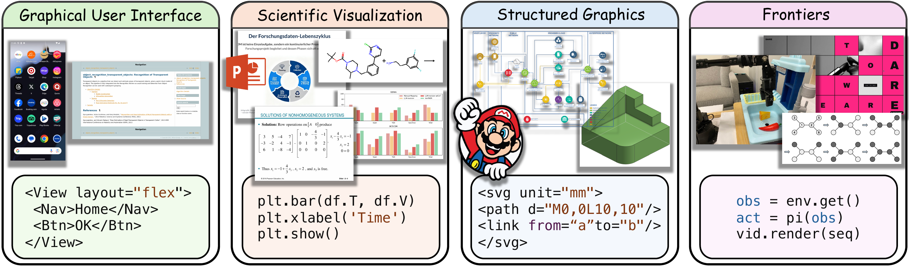
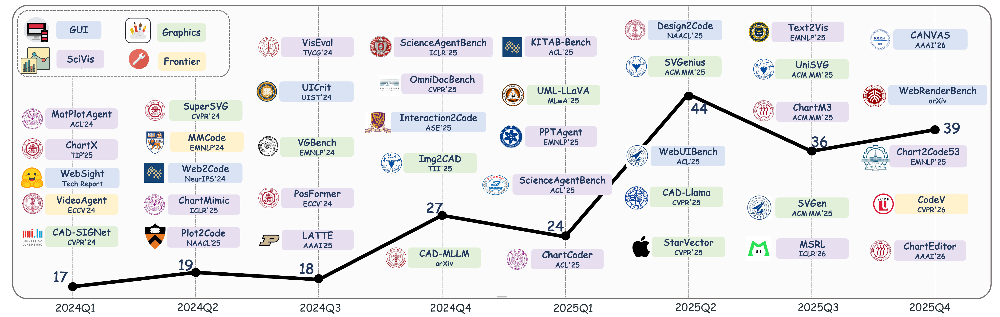
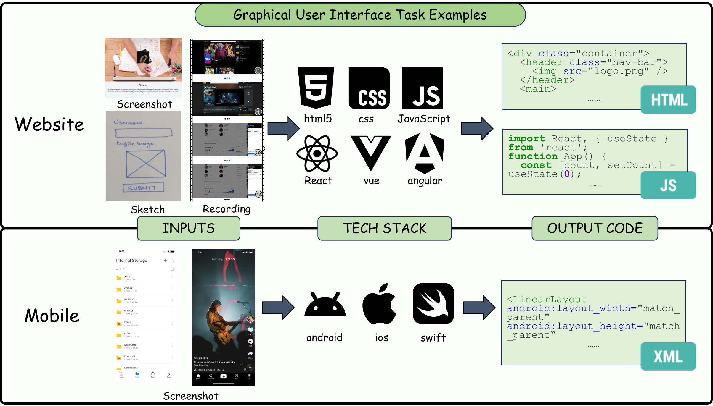
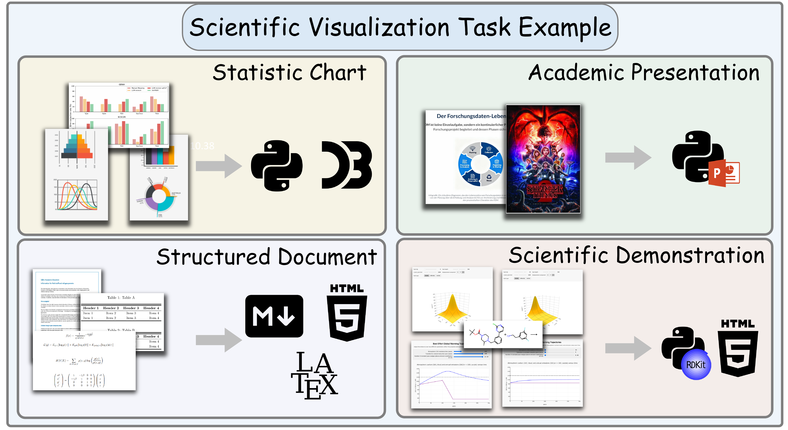
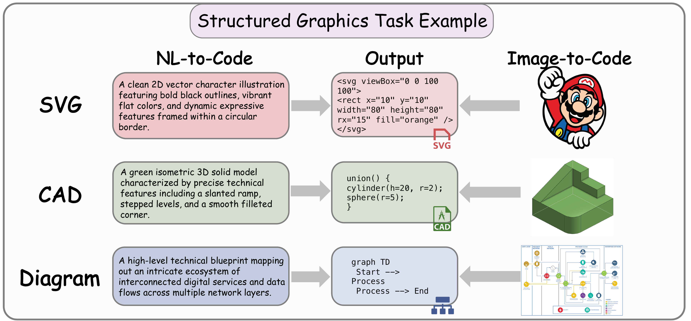
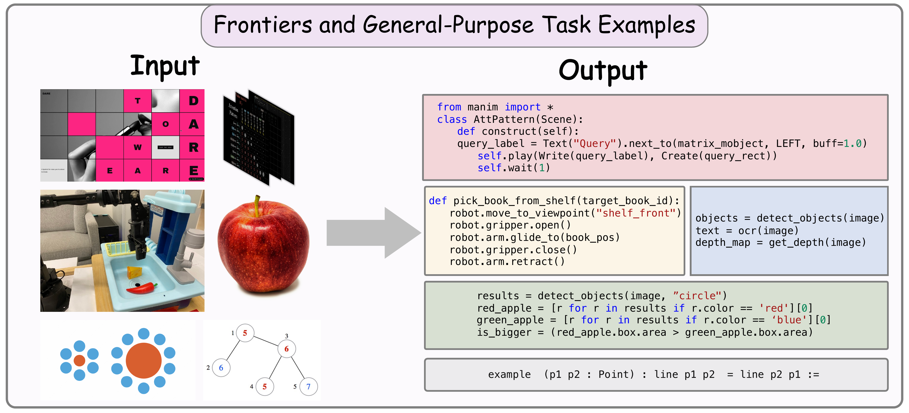

  <h1>Beyond NL2Code: A Structured Survey of Multimodal Code Intelligence</h1>
  
  
  

  

This repository tracks papers, benchmarks, datasets, and systems for **Multimodal Code Intelligence**, aligned with the survey paper **Beyond NL2Code: A Structured Survey of Multimodal Code Intelligence**.

The survey organizes the field by the role code plays when visual information is part of the programming task:
- **Graphical User Interface:** web and mobile UI generation, editing, refinement, interaction, and repair.
- **Scientific Visualization:** chart, document, slide, poster, and scientific-demonstration code that should preserve data, structure, equations, argument flow, and domain constraints.
- **Structured Graphics:** SVG, diagrams, CAD, and 3D shape programs where generated code should remain symbolic, editable, and structurally valid.
- **Frontier Tasks and Frameworks:** code as a visual-reasoning tool trace, software-repair interface, temporal procedure, embodied policy, game artifact, or unified multimodal-code interface.

Existing papers from the original awesome list are retained. New entries are added from the survey source in `/home/zhaoxuanle/private/MMC_Survey`, with the README reorganized to follow the paper's chapter structure.

  

# Content

- [1. Graphical User Interface](#1-graphical-user-interface)
  - [1.1 Website Application](#11-website-application)
  - [1.2 Mobile Application](#12-mobile-application)
- [2. Scientific Visualization](#2-scientific-visualization)
  - [2.1 Statistical Charts](#21-statistical-charts)
  - [2.2 Structured Document](#22-structured-document)
  - [2.3 Academic Presentations](#23-academic-presentations)
  - [2.4 Scientific Demonstration](#24-scientific-demonstration)
- [3. Structured Graphics](#3-structured-graphics)
  - [3.1 Scalable Vector Graphics (SVG)](#31-scalable-vector-graphics-svg)
  - [3.2 Diagram](#32-diagram)
  - [3.3 Computer-Aided Design (CAD)](#33-computer-aided-design-cad)
- [4. Frontier Tasks and Frameworks](#4-frontier-tasks-and-frameworks)
  - [4.1 Programmatic Visual Manipulation](#41-programmatic-visual-manipulation)
  - [4.2 Video Code Generation](#42-video-code-generation)
  - [4.3 Embodied Control](#43-embodied-control)
  - [4.4 Visually Grounded Programming](#44-visually-grounded-programming)
  - [4.5 Unified Multimodal Code Generation](#45-unified-multimodal-code-generation)
- [Contributing](#contributing)

---

# 📜 Papers

> You can directly click on a paper title to jump to its PDF, project page, or official source when a link is available.

## 1. Graphical User Interface

Graphical user interface code generation translates visual designs into executable implementations. This chapter covers web and mobile UI tasks, where evaluation must connect screenshots, generated code, rendered states, user actions, and implementation structure.

  

### 1.1 Website Application

1. [**Design2Code: How Far Are We From Automating Front-End Engineering?.**](https://arxiv.org/abs/2403.03163) *Chenglei Si, Yanzhe Zhang, Zhengyuan Yang, Ruibo Liu, Diyi Yang
.* NAACL 2025. &nbsp;&nbsp;&nbsp;&nbsp;&nbsp;&nbsp;&nbsp; 

2. [**Unlocking the conversion of Web Screenshots into HTML Code with the WebSight Dataset.**](https://arxiv.org/abs/2403.09029) *Hugo Laurençon, Léo Tronchon, Victor Sanh
.* Arxiv 2024.

3. [**VISION2UI: A Real-World Dataset with Layout for Code Generation from UI Designs.**](https://arxiv.org/abs/2404.06369) *Yi Gui, Zhen Li, Yao Wan, Yemin Shi, Hongyu Zhang, Yi Su, Shaoling Dong, Xing Zhou, Wenbin Jiang
.* Arxiv 2024.

4. [**NLDesign: A UI Design Tool for Natural Language Interfaces**](https://dl.acm.org/doi/10.1145/3674399.3674455) *Tianhao Zhang, Fu Peiguo, Jie Liu, Yihe Zhang, Xingmei Chen
.* ACM-TURC‘24 (2024.6.30)

5. [**Automatically Generating UI Code from Screenshot: A Divide-and-Conquer-Based Approach.**](https://arxiv.org/abs/2406.16386) *Yuxuan Wan, Chaozheng Wang, Yi Dong, Wenxuan Wang, Shuqing Li, Yintong Huo, Michael R. Lyu
.* Arxiv 2024 (FSE 2025). &nbsp;&nbsp;&nbsp;&nbsp;&nbsp;&nbsp;&nbsp; 

6. [**Web2Code: A Large-scale Webpage-to-Code Dataset and Evaluation Framework for Multimodal LLMs.**](https://arxiv.org/abs/2406.20098) *Sukmin Yun, Haokun Lin, Rusiru Thushara, Mohammad Qazim Bhat, Yongxin Wang, Zutao Jiang, Mingkai Deng, Jinhong Wang, Tianhua Tao, Junbo Li, Haonan Li, Preslav Nakov, Timothy Baldwin, Zhengzhong Liu, Eric P. Xing, Xiaodan Liang, Zhiqiang Shen
.* NeurIPS 2024 Datasets and Benchmarks. &nbsp;&nbsp;&nbsp;&nbsp;&nbsp;&nbsp;&nbsp; 

7. [**Prototype2Code: End-to-end Front-end Code Generation from UI Design Prototypes**](https://arxiv.org/abs/2405.04975) *Shuhong Xiao, Yunnong Chen, Jiazhi Li, Liuqing Chen, Lingyun Sun, Tingting Zhou
.* Arxiv 2024.

8. [**Bridging Design and Development with Automated Declarative UI Code Generation**](https://arxiv.org/abs/2409.11667) *Ting Zhou, Yanjie Zhao, Xinyi Hou, Xiaoyu Sun, Kai Chen, Haoyu Wang.* Arxiv 2024.(FSE 2025)

9. [**Sketch2Code: Evaluating Vision-Language Models for Interactive Web Design Prototyping**](https://arxiv.org/abs/2410.16232) *Ryan Li, Yanzhe Zhang, Diyi Yang .* Arxiv 2024. &nbsp;&nbsp;&nbsp;&nbsp;&nbsp;&nbsp;&nbsp; 

10. [**IW-Bench:Evaluating Large Multimodal Models for Converting Image-to-Web**](https://arxiv.org/abs/2409.18980) *Hongcheng Guo, Wei Zhang, Junhao Chen, Yaonan Gu, Jian Yang, Junjia Du, Binyuan Hui, Tianyu Liu, Jianxin Ma, Chang Zhou, Zhoujun Li
.* Arxiv 2024.9.14 (ACL 2025 Findings). &nbsp;&nbsp;&nbsp;&nbsp;&nbsp;&nbsp;&nbsp; 

11. [**Interaction2Code: How Far Are We From Automatic Interactive Webpage Generation?**](https://arxiv.org/abs/2411.03292) *Jingyu Xiao, Yuxuan Wan, Yintong Huo, Zixin Wang, Xinyi Xu, Wenxuan Wang, Zhiyao Xu, Yuhang Wang, Michael R. Lyu
.* Arxiv 2024 (ASE 2025). &nbsp;&nbsp;&nbsp;&nbsp;&nbsp;&nbsp;&nbsp; 

12. [**UIClip: A Data-driven Model for Assessing User Interface Design**](https://dl.acm.org/doi/10.1145/3654777.3676408) *Jason Wu, Yi-Hao Peng, Xin Yue Li, Amanda Swearngin, Jeffrey P. Biham, Jeffrey Nichols
.* UIST 2024.

13. [**WAFFLE: Multi-Modal Model for Automated Front-End Development**](https://www.arxiv.org/abs/2410.18362) *Shanchao Liang, Nan Jiang, Shangshu Qian, Lin Tan
.* Arxiv 2024 (ACL 2025 Main). &nbsp;&nbsp;&nbsp;&nbsp;&nbsp;&nbsp;&nbsp; 

14. [**MRWeb: An Exploration of Generating Multi-Page Resource-Aware Web Code from UI Designs**](https://arxiv.org/abs/2412.15310) *Yuxuan Wan, Yi Dong, Jingyu Xiao, Yintong Huo, Wenxuan Wang, Michael R. Lyu
.* Arxiv 2024. &nbsp;&nbsp;&nbsp;&nbsp;&nbsp;&nbsp;&nbsp; 

15. [**UICopilot: Automating UI Synthesis via Hierarchical Code Generation from Webpage Designs**](https://openreview.net/pdf?id=faMbH0wkye) * Yi Gui, Yao Wan, Zhen Li, Zhongyi Zhang, Dongping Chen, Hongyu Zhang, Yi Su, Bohua Chen, Xing Zhou, Wenbin Jiang, Xiangliang Zhang. WWW 2025 (Oral).

16. [**WebCode2M: A Real-World Dataset for Code Generation from Webpage Designs**](https://openreview.net/pdf?id=aeP5nmlw5B) * Yi Gui, Zhen Li, Yao Wan*, Yemin Shi, Hongyu Zhang, Yi Su, Bohua Chen, Dongping Chen, Siyuan Wu, Xing Zhou, Wenbin Jiang, Hai Jin, Xiangliang Zhang. WWW 2025 (Oral). &nbsp;&nbsp;&nbsp;&nbsp;&nbsp;&nbsp;&nbsp; 

17. [**Zero-Shot Prompting Approaches for LLM-based Graphical User Interface Generation**](https://arxiv.org/abs/2412.11328) * Kristian Kolthoff, Felix Kretzer, Lennart Fiebig, Christian Bartelt, Alexander Maedche, Simone Paolo Ponzetto.Arxiv 2024.12.

18. [**Towards Human-AI Synergy in UI Design: Enhancing Multi-Agent Based UI Generation with Intent Clarification and Alignment**](https://arxiv.org/abs/2412.20071) *Mingyue Yuan, Jieshan Chen, Yongquan Hu, Sidong Feng, Mulong Xie, Gelareh Mohammadi, Zhenchang Xing, Aaron Quigley.Arxiv 2024.12.28
    
19. [**Frontend Diffusion: Empowering Self-Representation of Junior Researchers and Designers Through Agentic Workflows**](https://arxiv.org/abs/2502.03788) *Zijian Ding, Qinshi Zhang, Mohan Chi, Ziyi Wang. Arxiv 2025.

20. [**UICrit: Enhancing Automated Design Evaluation with a UICritique Dataset**](https://arxiv.org/abs/2407.08850) *Peitong Duan, Chin-yi Chen, Gang Li, Bjoern Hartmann, Yang Li.* Arxiv 2024.7.11 (UIST 2024). &nbsp;&nbsp;&nbsp;&nbsp;&nbsp;&nbsp;&nbsp; 

21. [**Advancing vision-language models in front-end development via data synthesis**](https://arxiv.org/html/2503.01619v1) *Tong Ge, Yashu Liu, Jieping Ye, Tianyi Li, Chao Wang
.* Arxiv 2025.3.3. &nbsp;&nbsp;&nbsp;&nbsp;&nbsp;&nbsp;&nbsp; 

22. [**Multimodal graph representation learning for website generation based on visual sketch**](https://arxiv.org/abs/2504.18729) *Tung D. Vu, Chung Hoang, Truong-Son Hy.* Arxiv 2025.4.26. &nbsp;&nbsp;&nbsp;&nbsp;&nbsp;&nbsp;&nbsp; 

23. [**WebGen-Bench: Evaluating LLMs on Generating Interactive and Functional Websites from Scratch**](https://arxiv.org/abs/2505.03733) *Zimu Lu, Yunqiao Yang, Houxing Ren, Haotian Hou, Han Xiao, Ke Wang, Weikang Shi, Aojun Zhou, Mingjie Zhan, Hongsheng Li.* Arxiv 2025.5.6. &nbsp;&nbsp;&nbsp;&nbsp;&nbsp;&nbsp;&nbsp; 

24. [**Web-Bench: A LLM Code Benchmark Based on Web Standards and Frameworks**](https://arxiv.org/abs/2505.17399) *Kai Xu, YiWei Mao, XinYi Guan, ZiLong Feng.* Arxiv 2025.5.12. &nbsp;&nbsp;&nbsp;&nbsp;&nbsp;&nbsp;&nbsp; 

25. [**FullFront: Benchmarking MLLMs Across the Full Front-End Engineering Workflow**](https://arxiv.org/abs/2505.17399) *Haoyu Sun, Huichen Will Wang, Jiawei Gu, Linjie Li, Yu Cheng.* Arxiv 2025.5.23. &nbsp;&nbsp;&nbsp;&nbsp;&nbsp;&nbsp;&nbsp; 

26. [**DesignBench: A Comprehensive Benchmark for MLLM-based Front-end Code Generation**](https://arxiv.org/abs/2506.06251) *Jingyu Xiao, Ming Wang, Man Ho Lam, Yuxuan Wan, Junliang Liu, Yintong Huo, Michael R. Lyu.* Arxiv 2025.6.6. &nbsp;&nbsp;&nbsp;&nbsp;&nbsp;&nbsp;&nbsp; 
    
27. [**WebUIBench: A Comprehensive Benchmark for Evaluating Multimodal Large Language Models in WebUI-to-Code**](https://arxiv.org/abs/2506.07818) *Zhiyu Lin, Zhengda Zhou, Zhiyuan Zhao, Tianrui Wan, Yilun Ma, Junyu Gao, Xuelong Li.* Arxiv 2025.6.9. &nbsp;&nbsp;&nbsp;&nbsp;&nbsp;&nbsp;&nbsp; 
    
28. [**MLLM-Based UI2Code Automation Guided by UI Layout Information**](https://arxiv.org/abs/2506.10376) *Fan Wu, Cuiyun Gao, Shuqing Li, Xin-Cheng Wen, Qing Liao.* Arxiv 2025.6.12.（ISSTA 2025） &nbsp;&nbsp;&nbsp;&nbsp;&nbsp;&nbsp;&nbsp; 

29. [**DesignCoder: Hierarchy-Aware and Self-Correcting UI Code Generation with Large Language Models**](https://arxiv.org/abs/2506.10376) *Fan Wu, Cuiyun Gao, Shuqing Li, Xin-Cheng Wen, Qing Liao.* Arxiv 2025.6.16.
  
30. [**FrontendBench: A Benchmark for Evaluating LLMs on Front-End Development via Automatic Evaluation**](https://www.arxiv.org/abs/2506.13832) *Hongda Zhu, Yiwen Zhang, Bing Zhao, Jingzhe Ding, Siyao Liu, Tong Liu, Dandan Wang, Yanan Liu, Zhaojian Lio.* Arxiv 2025.6.16.

31. [**ScreenCoder: Advancing Visual-to-Code Generation for Front-End Automation via Modular Multimodal Agents**](https://arxiv.org/pdf/2507.22827) *Yilei Jiang, Yaozhi Zheng, Yuxuan Wan, Jiaming Han, Qunzhong Wang, Michael R. Lyu, Xiangyu Yue.* Arxiv 2025.7.31. &nbsp;&nbsp;&nbsp;&nbsp;&nbsp;&nbsp;&nbsp; 

32. [**Generative Interfaces for Language Models**](https://arxiv.org/abs/2508.19227) *Jiaqi Chen, Yanzhe Zhang, Yutong Zhang, Yijia Shao, Diyi Yang.* Arxiv 2025.8.26. &nbsp;&nbsp;&nbsp;&nbsp;&nbsp;&nbsp;&nbsp; 

33. [**UI-Bench: A Benchmark for Evaluating Design Capabilities of AI Text-to-App Tools**](https://arxiv.org/abs/2508.20410) *Sam Jung, Agustin Garcinuno, Spencer Mateega.* Arxiv 2025.8.28.

34. [**EfficientUICoder: Efficient MLLM-based UI Code Generation via Input and Output Token Compression**](https://arxiv.org/abs/2509.12159) *Jingyu Xiao, Zhongyi Zhang, Yuxuan Wan, Yintong Huo, Yang Liu, Michael R.Lyu.* Arxiv 2025.9.15 (FSE 2026). &nbsp;&nbsp;&nbsp;&nbsp;&nbsp;&nbsp;&nbsp; 
 
35. [**WebGen-Agent: Enhancing Interactive Website Generation with Multi-Level Feedback and Step-Level Reinforcement Learning**](https://arxiv.org/pdf/2509.22644) *Zimu Lu, Houxing Ren, Yunqiao Yang, Ke Wang, Zhuofan Zong, Junting Pan, Mingjie Zhan, Hongsheng Li.* Arxiv 2025.9.26. &nbsp;&nbsp;&nbsp;&nbsp;&nbsp;&nbsp;&nbsp; 

36. [**UI-UG: A Unified MLLM for UI Understanding and Generation**](https://arxiv.org/abs/2509.24361) *Hao Yang, Weijie Qiu, Ru Zhang, Zhou Fang, Ruichao Mao, Xiaoyu Lin, Maji Huang, Zhaosong Huang, Teng Guo, Shuoyang Liu, Hai Rao.* Arxiv 2025.9.29. &nbsp;&nbsp;&nbsp;&nbsp;&nbsp;&nbsp;&nbsp; 
 
37. [**IWR-Bench: Can LVLMs reconstruct interactive webpage from a user interaction video?**](https://arxiv.org/pdf/2509.22644) *Yang Chen, Minghao Liu, Yufan Shen, Yunwen Li, Tianyuan Huang, Xinyu Fang, Tianyu Zheng, Wenxuan Huang, Cheng Yang, Daocheng Fu, Jianbiao Mei, Rong Wu, Licheng Wen, Xuemeng Yang, Song Mao, Qunshu Lin, Zhi Yu, Yongliang Shen, Yu Qiao, Botian Shi.* Arxiv 2025.9.29 (ICLR 2026).

38. [**Automatically Generating Web Applications from Requirements Via Multi-Agent Test-Driven Development**](https://www.arxiv.org/abs/2509.25297) *Yuxuan Wan, Tingshuo Liang, Jiakai Xu, Jingyu Xiao, Yintong Huo, Michael R. Lyu.* Arxiv 2025.9.29. &nbsp;&nbsp;&nbsp;&nbsp;&nbsp;&nbsp;&nbsp; 

39. [**WebRenderBench: Enhancing Web Interface Generation through Layout-Style Consistency and Reinforcement Learning**](https://arxiv.org/abs/2510.04097) *Peichao Lai, Jinhui Zhuang, Kexuan Zhang, Ningchang Xiong, Shengjie Wang, Yanwei Xu, Chong Chen, Yilei Wang, Bin Cui.* Arxiv 2025.10.5.

40. [**ReLook: Vision-Grounded RL with a Multimodal LLM Critic for Agentic Web Coding**](https://arxiv.org/abs/2510.11498) *Yuhang Li, Chenchen Zhang, Ruilin Lv, Ao Liu, Ken Deng, Yuanxing Zhang, Jiaheng Liu, Wiggin Zhou, Bo Zhou.* Arxiv 2025.10.13.

41. [**WebGen-V Bench: Structured Representation for Enhancing Visual Design in LLM-based Web Generation and Evaluation**](https://arxiv.org/abs/2510.15306) *Kuang-Da Wang, Zhao Wang, Yotaro Shimose, Wei-Yao Wang, Shingo Takamatsu.* Arxiv 2025.10.17. &nbsp;&nbsp;&nbsp;&nbsp;&nbsp;&nbsp;&nbsp; 

42. [**UIOrchestra: Generating High-Fidelity Code from UI Designs with a Multi-agent System**](https://aclanthology.org/2025.findings-emnlp.150/) *huhuai Yue, Jiajun Chai, Yufei Zhang, Zixiang Ding, Xihao Liang, Peixin Wang, Shihai Chen, Wang Yixuan, Guojun Yin, Wei Lin.* Arxiv 2025.11.08.

43. [**WebVIA: A Web-based Vision-Language Agentic Framework for Interactive and Verifiable UI-to-Code Generation**](https://arxiv.org/abs/2511.06251)*Mingde Xu, Zhen Yang, Wenyi Hong, Lihang Pan, Xinyue Fan, Yan Wang, Xiaotao Gu, Bin Xu, Jie Tang* Arxiv 2025.11.09. &nbsp;&nbsp;&nbsp;&nbsp;&nbsp;&nbsp;&nbsp; 

44. [**UI2CodeN: A Visual Language Model for Test-Time Scalable Interactive UI-to-Code Generation**](https://arxiv.org/abs/2511.08195)*Zhen Yang, Wenyi Hong, Mingde Xu, Xinyue Fan, Weihan Wang, Jiele Cheng, Xiaotao Gu, Jie Tangg* Arxiv 2025.11.11. &nbsp;&nbsp;&nbsp;&nbsp;&nbsp;&nbsp;&nbsp; 

45. [**Computer-Use Agents as Judges for Generative User Interface**](https://arxiv.org/abs/2511.15567)*Kevin Qinghong Lin, Siyuan Hu, Linjie Li, Zhengyuan Yang, Lijuan Wang, Philip Torr, Mike Zheng Shou* Arxiv 2025.11.19. &nbsp;&nbsp;&nbsp;&nbsp;&nbsp;&nbsp;&nbsp; 

46. [**CANVAS: A Benchmark for Vision-Language Models on Tool-Based User Interface Design**](https://arxiv.org/abs/2511.20737)*Daeheon Jeong, Seoyeon Byun, Kihoon Son, Dae Hyun Kim, Juho Kim* Arxiv 2025.11.25 (AAAI 2026). &nbsp;&nbsp;&nbsp;&nbsp;&nbsp;&nbsp;&nbsp; 

47. [**Beyond Prototyping: Autonomous, Enterprise-Grade Frontend Development from Pixel to Production via a Specialized Multi-Agent Framework**](https://arxiv.org/abs/2512.06046)*Ramprasath Ganesaraja, Swathika N, Saravanan AP, Kamalkumar Rathinasamy, Chetana Amancharla, Rahul Das, Sahil Dilip Panse, Aditya Batwe, Dileep Vijayan, Veena Ashok, Thanushree A P, Kausthubh J Rao, Alden Olivero, Roshan, Rajeshwar Reddy Manthena, Asmitha Yuga Sre A, Harsh Tripathi, Suganya Selvaraj, Vito Chin, Kasthuri Rangan Bhaskar, Kasthuri Rangan Bhaskar, Venkatraman R, Sajit Vijayakumar* Arxiv 2025.12.05.

48.  [**FronTalk: Benchmarking Front-End Development as Conversational Code Generation with Multi-Modal Feedback**](https://arxiv.org/abs/2601.04203)*Xueqing Wu, Zihan Xue, Da Yin, Shuyan Zhou, Kai-Wei Chang, Nanyun Peng, Yeming Wen* Arxiv 2025.12.05. &nbsp;&nbsp;&nbsp;&nbsp;&nbsp;&nbsp;&nbsp; 

49. [**Widget2Code: From Visual Widgets to UI Code via Multimodal LLMs**](https://arxiv.org/abs/2512.19918)*Houston H. Zhang, Tao Zhang, Baoze Lin, Yuanqi Xue, Yincheng Zhu, Huan Liu, Li Gu, Linfeng Ye, Ziqiang Wang, Xinxin Zuo, Yang Wang, Yuanhao Yu, Zhixiang Chi* Arxiv 2025.12.22 (CVPR 2026). &nbsp;&nbsp;&nbsp;&nbsp;&nbsp;&nbsp;&nbsp;  

50. [**WebCoderBench: Benchmarking Web Application Generation with Comprehensive and Interpretable Evaluation Metrics**](https://web3.arxiv.org/abs/2601.02430)*Chenxu Liu, Yingjie Fu, Wei Yang, Ying Zhang, Tao Xie* Arxiv 2026.01.05.

51. [**FullStack-Agent: Enhancing Agentic Full-Stack Web Coding via Development-Oriented Testing and Repository Back-Translation**](https://arxiv.org/abs/2602.03798)*Zimu Lu, Houxing Ren, Yunqiao Yang, Ke Wang, Zhuofan Zong, Mingjie Zhan, Hongsheng Li* Arxiv 2026.02.03. &nbsp;&nbsp;&nbsp;&nbsp;&nbsp;&nbsp;&nbsp;  

52. [**VisRefiner: Learning from Visual Differences for Screenshot-to-Code Generation**](https://arxiv.org/abs/2602.05998)*Jie Deng, Kaichun Yao, Libo Zhang* Arxiv 2026.02.05.

53. [**Bridging Design and Implementation: A Study of Multi-Agent LLM Architectures for Automated Front-End Generation**](https://das.encs.concordia.ca/pdf/rizk_MSR2026.pdf)*Caren Rizk, SayedHassan Khatoonabadi, Emad Shihab* (MSR 2026)

54. [**SWE-Bench Mobile: Can Large Language Model Agents Develop Industry-Level Mobile Applications?**](https://arxiv.org/abs/2602.09540)*Muxin Tian, Zhe Wang, Blair Yang, Zhenwei Tang, Kunlun Zhu, Honghua Dong, Hanchen Li, Xinni Xie, Guangjing Wang, Jiaxuan You* Arxiv 2026.02.10.

55. [**1D-Bench: A Benchmark for Iterative UI Code Generation with Visual Feedback in Real-World**](https://arxiv.org/abs/2602.18548)*Qiao Xu, Yipeng Yu, Chengxiao Feng, Xu Liu* Arxiv 2026.02.20.

56. [**ComUICoder: Component-based Reusable UI Code Generation for Complex Websites via Semantic Segmentation and Element-wise Feedback**](https://arxiv.org/abs/2602.19276)*Jingyu Xiao, Jiantong Qin, Shuoqi Li, Man Ho Lam, Yuxuan Wan, Jen-tse Huang, Yintong Huo, Michael R. Lyu* Arxiv 2026.02.22. (KDD 2026) &nbsp;&nbsp;&nbsp;&nbsp;&nbsp;&nbsp;&nbsp;  

57. [**𝐿𝑖𝑘𝑒𝑇ℎ𝑖𝑠! Empowering App Users to Submit UI Improvement Suggestions Instead of Complaints**](https://arxiv.org/abs/2603.04245)*Jialiang Wei, Ali Ebrahimi Pourasad, Walid Maalej* Arxiv 2026.03.04.

58. [**No Code, No Cloud: On-Device Mockup-to-Code withLightweight Vision-Language AI**](https://dl.acm.org/doi/full/10.1145/3742413.3789144)*Abinas Kuganathan, Mitra Purandare, Markus Stolze* 2026.03.22 (IUI 2026).

59. [**AutoStructGUI: Bridging Design and Implementation of GUI through Structured Layout Generation**](https://dl.acm.org/doi/full/10.1145/3742413.3789058)*Junquan Ren, Pengfei Xu* 2026.03.22 (IUI 2026).

60. [**Vision2Web: A Hierarchical Benchmark for Visual Website Development with Agent Verification**](https://dl.acm.org/doi/full/10.1145/3742413.3789058)*Zehai He, Wenyi Hong, Zhen Yang, Ziyang Pan, Mingdao Liu, Xiaotao Gu, Jie Tang* 2026.03.27 &nbsp;&nbsp;&nbsp;&nbsp;&nbsp;&nbsp;&nbsp; 

61. [**MM-WebAgent: A Hierarchical Multimodal Web Agent for Webpage Generation**](https://arxiv.org/abs/2604.15309)*Yan Li, Zezi Zeng, Yifan Yang, Yuqing Yang, Ning Liao, Weiwei Guo, Lili Qiu, Mingxi Cheng, Qi Dai, Zhendong Wang, Zhengyuan Yang, Xue Yang, Ji Li, Lijuan Wang, Chong Luo* 2026.04.16. &nbsp;&nbsp;&nbsp;&nbsp;&nbsp;&nbsp;&nbsp;  

62. [**WebCompass: Towards Multimodal Web Coding Evaluation for Code Language Models**](https://arxiv.org/abs/2604.18224)*Xinping Lei, Xinyu Che, Junqi Xiong, Chenchen Zhang, Yukai Huang, Chenyu Zhou, Haoyang Huang, Minghao Liu, Letian Zhu, Hongyi Ye, Jinhua Hao, Ken Deng, Zizheng Zhan, Han Li, Dailin Li, Yifan Yao, Ming Sun, Zhaoxiang Zhang, Jiaheng Liu* 2026.04.20. &nbsp;&nbsp;&nbsp;&nbsp;&nbsp;&nbsp;&nbsp;  

63. [**Benchmarking Multimodal LLMs on Code Generation for Complex Interactive Webpages**](https://arxiv.org/abs/2606.00154)*Fan Wu, Lishuai Dong, Cuiyun Gao, Yujia Chen, Yiming Huang, Yang Xiao, Qing Liao* 2026.05.29.

64. [**I-WebGenBench: Evaluating Interactivity in LLM-Generated Scientific Web Applications**](https://arxiv.org/abs/2606.00750)*Dasen Dai, Biao Wu, Meng Fang, Shuoqi Li, Wenhao Wang* 2026.05.30.

65. [**ProductWebGen: Benchmarking Multimodal Product Webpage Generation**](https://arxiv.org/abs/2604.18224)*Zhihong Liu, Siqi Kou, Zheng Li, Ye Ma, Quan Chen, Peng Jiang, Kai Yu, Zhijie Deng* 2026.05.31.（KDD 2026） &nbsp;&nbsp;&nbsp;&nbsp;&nbsp;&nbsp;&nbsp;  

### 1.2 Mobile Application

Mobile code generation lacks the browser-like source-render-interaction loop available to web tasks. Current benchmarks and methods therefore rely on proxy signals from mockups, design-tool states, UI hierarchies, critiques, learned rewards, retrieval, and editable intermediate representations.

1. [**Rico: A Mobile App Dataset for Building Data-Driven Design Applications**](https://dl.acm.org/doi/10.1145/3126594.3126651) *Biplab Deka, Zifeng Huang, Chad Franzen, Joshua Hibschman, Daniel Afergan, Yang Li, Jeffrey Nichols, Ranjitha Kumar.* UIST 2017.

2. [**UICrit: Enhancing Automated Design Evaluation with a UICritique Dataset**](https://arxiv.org/abs/2407.08850) *Peitong Duan, Chin-Yi Cheng, Gang Li, Bjoern Hartmann, Yang Li.* UIST 2024. &nbsp;&nbsp;&nbsp;&nbsp;&nbsp;&nbsp;&nbsp; 

3. [**UIClip: A Data-Driven Model for Assessing User Interface Design**](https://dl.acm.org/doi/10.1145/3654777.3676408) *Jason Wu, Yi-Hao Peng, Xin Yue Amanda Li, Amanda Swearngin, Jeffrey P. Bigham, Jeffrey Nichols.* UIST 2024.

4. [**Bridging Design and Development with Automated Declarative UI Code Generation**](https://arxiv.org/abs/2409.11667) *Ting Zhou, Yanjie Zhao, Xinyi Hou, Xiaoyu Sun, Kai Chen, Haoyu Wang.* Arxiv 2024.9.16 (FSE 2025).

5. [**Zero-Shot Prompting Approaches for LLM-Based Graphical User Interface Generation**](https://arxiv.org/abs/2412.11328) *Kristian Kolthoff, Felix Kretzer, Lennart Fiebig, Christian Bartelt, Alexander Maedche, Simone Paolo Ponzetto.* Arxiv 2024.12.15. &nbsp;&nbsp;&nbsp;&nbsp;&nbsp;&nbsp;&nbsp; 

6. [**Towards Human-AI Synergy in UI Design: Enhancing Multi-Agent Based UI Generation with Intent Clarification and Alignment**](https://arxiv.org/abs/2412.20071) *Mingyue Yuan, Jieshan Chen, Yongquan Hu, Sidong Feng, Mulong Xie, Gelareh Mohammadi, Zhenchang Xing, Aaron Quigley.* Arxiv 2024.12.28.

7. [**UIOrchestra: Generating High-Fidelity Code from UI Designs with a Multi-agent System**](https://aclanthology.org/2025.findings-emnlp.150/) *Chuhuai Yue, Jiajun Chai, Yufei Zhang, Zixiang Ding, Xihao Liang, Peixin Wang, Shihai Chen, Yixuan Wang, Guojun Yin, Wei Lin, et al.* EMNLP 2025 Findings.

8. [**DesignCoder: Hierarchy-Aware and Self-Correcting UI Code Generation with Large Language Models**](https://arxiv.org/abs/2506.13663) *Yunnong Chen, Shixian Ding, Yingying Zhang, Wenkai Chen, Jinzhou Du, Lingyun Sun, Liuqing Chen.* Arxiv 2025.6.16.

9. [**Generative Interfaces for Language Models**](https://arxiv.org/abs/2508.19227) *Jiaqi Chen, Yanzhe Zhang, Yutong Zhang, Yijia Shao, Diyi Yang.* Arxiv 2025.8.26. &nbsp;&nbsp;&nbsp;&nbsp;&nbsp;&nbsp;&nbsp; 

10. [**UI-UG: A Unified MLLM for UI Understanding and Generation**](https://arxiv.org/abs/2509.24361) *Hao Yang, Weijie Qiu, Ru Zhang, Zhou Fang, Ruichao Mao, Xiaoyu Lin, Maji Huang, Zhaosong Huang, Teng Guo, Shuoyang Liu, et al.* Arxiv 2025.9.29. &nbsp;&nbsp;&nbsp;&nbsp;&nbsp;&nbsp;&nbsp; 

11. [**CANVAS: A Benchmark for Vision-Language Models on Tool-Based User Interface Design**](https://arxiv.org/abs/2511.20737) *Daeheon Jeong, Seoyeon Byun, Kihoon Son, Dae Hyun Kim, Juho Kim.* Arxiv 2025.11.25 (AAAI 2026). &nbsp;&nbsp;&nbsp;&nbsp;&nbsp;&nbsp;&nbsp; 

## 2. Scientific Visualization

Scientific visualization code should make visual claims inspectable, not only render plausible artifacts. This chapter covers charts, structured documents, academic presentations, posters, and scientific demonstrations.

  

### 2.1 Statistical Charts

1. [**Plot2Code: A Comprehensive Benchmark for Evaluating Multi-modal Large Language Models in Code Generation from Scientific Plots.**](https://arxiv.org/abs/2405.07990) *Chengyue Wu, Yixiao Ge, Qiushan Guo, Jiahao Wang, Zhixuan Liang, Zeyu Lu, Ying Shan, Ping Luo
.* Arxiv 2024. (NAACL 2025 Findings) &nbsp;&nbsp;&nbsp;&nbsp;&nbsp;&nbsp;&nbsp; 

2. [**MatPlotAgent: Method and Evaluation for LLM-Based Agentic Scientific Data Visualization.**](https://arxiv.org/abs/2402.11453) *Zhiyu Yang, Zihan Zhou, Shuo Wang, Xin Cong, Xu Han, Yukun Yan, Zhenghao Liu, Zhixing Tan, Pengyuan Liu, Dong Yu, Zhiyuan Liu, Xiaodong Shi, Maosong Sun
.* Arxiv 2024. &nbsp;&nbsp;&nbsp;&nbsp;&nbsp;&nbsp;&nbsp; 

3. [**ChartMimic: Evaluating LMM's Cross-Modal Reasoning Capability via Chart-to-Code Generation.**](https://arxiv.org/abs/2406.09961) Chufan Shi, Cheng Yang, Yaxin Liu, Bo Shui, Junjie Wang, Mohan Jing, Linran Xu, Xinyu Zhu, Siheng Li, Yuxiang Zhang, Gongye Liu, Xiaomei Nie, Deng Cai, Yujiu Yang
.* Arxiv 2024. &nbsp;&nbsp;&nbsp;&nbsp;&nbsp;&nbsp;&nbsp; 

4. [**From Words to Structured Visuals: A Benchmark and Framework for Text-to-Diagram Generation and Editing.**](https://arxiv.org/abs/2411.11916) Jingxuan Wei, Cheng Tan, Qi Chen, Gaowei Wu, Siyuan Li, Zhangyang Gao, Linzhuang Sun, Bihui Yu, Ruifeng Guo
.* Arxiv 2024. &nbsp;&nbsp;&nbsp;&nbsp;&nbsp;&nbsp;&nbsp; 

5. [**Is GPT-4V (ision) All You Need for Automating Academic Data Visualization? Exploring Vision-Language Models’ Capability in Reproducing Academic Charts.**](https://aclanthology.org/2024.findings-emnlp.485/) Zhehao Zhang, Weicheng Ma, Soroush Vosoughi
.* EMNLP 2024 (Findings). &nbsp;&nbsp;&nbsp;&nbsp;&nbsp;&nbsp;&nbsp; 

6. [**ChartMoE: Mixture of Diversely Aligned Expert Connector for Chart Understanding.**](https://arxiv.org/abs/2409.03277) Zhengzhuo Xu, Bowen Qu, Yiyan Qi, Sinan Du, Chengjin Xu, Chun Yuan, Jian Guo.* Arxiv 2024.9 (ICLR 2025 Oral). &nbsp;&nbsp;&nbsp;&nbsp;&nbsp;&nbsp;&nbsp; 

7. [**ChartCoder: Advancing Multimodal Large Language Model for Chart-to-Code Generation.**](https://arxiv.org/abs/2501.06598) Xuanle Zhao, Xianzhen Luo, Qi Shi, Chi Chen, Shuo Wang, Wanxiang Che, Zhiyuan Liu, Maosong Sun.* Arxiv 2025.1 (ACL 2025 Main). &nbsp;&nbsp;&nbsp;&nbsp;&nbsp;&nbsp;&nbsp; 

8. [**nvAgent: Automated Data Visualization from Natural Language via Collaborative Agent Workflow.**](https://arxiv.org/abs/2502.05036) Geliang Ouyang, Jingyao Chen, Zhihe Nie, Yi Gui, Yao Wan, Hongyu Zhang, Dongping Chen.* Arxiv 2025.2.7 (ACL 2025 Main). &nbsp;&nbsp;&nbsp;&nbsp;&nbsp;&nbsp;&nbsp; 

9. [**METAL: A Multi-Agent Framework for Chart Generation with Test-Time Scaling**](https://arxiv.org/abs/2502.17651) *Bingxuan Li, Yiwei Wang, Jiuxiang Gu, Kai-Wei Chang, Nanyun Peng.* Arxiv 2025.2.24 (ACL 2025 Main). &nbsp;&nbsp;&nbsp;&nbsp;&nbsp;&nbsp;&nbsp; 

10. [**Chain of Functions: A Programmatic Pipeline for Fine-Grained Chart Reasoning Data**](https://arxiv.org/abs/2503.16260) *Zijian Li, Jingjing Fu, Lei Song, Jiang Bian, Jun Zhang, Rui Wang
.* Arxiv 2025.3.20.

11. [**Enhancing Chart-to-Code Generation in Multimodal Large Language Models via Iterative Dual Preference Learning.**](https://arxiv.org/pdf/2504.02906) Zhihan Zhang, Yixin Cao, and Lizi Liao.* Arxiv 2025.4.3. &nbsp;&nbsp;&nbsp;&nbsp;&nbsp;&nbsp;&nbsp; 

12. [**Draw with Thought: Unleashing Multimodal Reasoning for Scientific Diagram Generation.**](https://arxiv.org/abs/2504.09479) Zhiqing Cui, Jiahao Yuan, Hanqing Wang, Yanshu Li, Chenxu Du, Zhenglong Ding.* Arxiv 2025.4.13.
  
13. [**ChartEdit: How Far Are MLLMs From Automating Chart Analysis? Evaluating MLLMs' Capability via Chart Editing.**](https://arxiv.org/abs/2505.11935) Xuanle Zhao, Xuexin Liu, Haoyue Yang, Xianzhen Luo, Fanhu Zeng, Jianling Li, Qi Shi, Chi Chen.* Arxiv 2025.5.17. (ACL 2025 Findings). &nbsp;&nbsp;&nbsp;&nbsp;&nbsp;&nbsp;&nbsp; 

14. [**ChartMuseum: Testing Visual Reasoning Capabilities of Large Vision-Language Models.**](https://arxiv.org/abs/2505.13444) Liyan Tang, Grace Kim, Xinyu Zhao, Thom Lake, Wenxuan Ding, Fangcong Yin, Prasann Singhal, Manya Wadhwa, Zeyu Leo Liu, Zayne Sprague, Ramya Namuduri, Bodun Hu, Juan Diego Rodriguez, Puyuan Peng, Greg Durrett.* Arxiv 2025.5.19.&nbsp;&nbsp;&nbsp;&nbsp;&nbsp;&nbsp;&nbsp; 

15. [**ChartCards: A Chart-Metadata Generation Framework for Multi-Task Chart Understanding.**](https://arxiv.org/abs/2505.11935) Yifan Wu, Lutao Yan, Leixian Shen, Yinan Mei, Jiannan Wang, Yuyu Luo.* Arxiv 2025.5.21.&nbsp;&nbsp;&nbsp;&nbsp;&nbsp;&nbsp;&nbsp; 

16. [**Multimodal DeepResearcher: Generating Text-Chart Interleaved Reports From Scratch with Agentic Framework.**](https://arxiv.org/abs/2506.02454) Zhaorui Yang, Bo Pan, Han Wang, Yiyao Wang, Xingyu Liu, Minfeng Zhu, Bo Zhang, Wei Chen.* Arxiv 2025.6.3. &nbsp;&nbsp;&nbsp;&nbsp;&nbsp;&nbsp;&nbsp; 
  
17. [**Generating Pedagogically Meaningful Visuals for Math Word Problems: A New Benchmark and Analysis of Text-to-Image Models.**](https://arxiv.org/abs/2506.03735) Junling Wang, Anna Rutkiewicz, April Yi Wang, Mrinmaya Sachan.* Arxiv 2025.6.4. (ACL 2025 Findings) &nbsp;&nbsp;&nbsp;&nbsp;&nbsp;&nbsp;&nbsp; 

18. [**VisCoder: Fine-Tuning LLMs for Executable Python Visualization Code Generation.**](https://arxiv.org/abs/2506.03735) Yuansheng Ni, Ping Nie, Kai Zou, Xiang Yue, Wenhu Chen.* Arxiv 2025.6.4. (EMNLP 2025 Findings) &nbsp;&nbsp;&nbsp;&nbsp;&nbsp;&nbsp;&nbsp; 

19. [**Effective Training Data Synthesis for Improving MLLM Chart Understanding.**](https://arxiv.org/abs/2508.06492) Yuwei Yang, Zeyu Zhang, Yunzhong Hou, Zhuowan Li, Gaowen Liu, Ali Payani, Yuan-Sen Ting, Liang Zheng. Arxiv 2025.8.8. (ICCV 2025) &nbsp;&nbsp;&nbsp;&nbsp;&nbsp;&nbsp;&nbsp; 

20. [**Breaking the SFT Plateau: Multimodal Structured Reinforcement Learning for Chart-to-Code Generation.**](https://arxiv.org/abs/2508.06492) Lei Chen, Xuanle Zhao, Zhixiong Zeng, Jing Huang, Liming Zheng, Yufeng Zhong, Lin Ma. Arxiv 2025.8.19 (ICLR 2026). &nbsp;&nbsp;&nbsp;&nbsp;&nbsp;&nbsp;&nbsp; 

21. [**ChartMaster: Advancing Chart-to-Code Generation with Real-World Charts and Chart Similarity Reinforcement Learning.**](https://arxiv.org/abs/2508.17608) Wentao Tan, Qiong Cao, Chao Xue, Yibing Zhan, Changxing Ding, Xiaodong He. Arxiv 2025.8.25. &nbsp;&nbsp;&nbsp;&nbsp;&nbsp;&nbsp;&nbsp; 

22. [**OpusAnimation: Code-Based Dynamic Chart Generation.**](https://arxiv.org/abs/2510.03341) Bozheng Li, Miao Yang, Zhenhan Chen, Jiawang Cao, Mushui Liu, Yi Lu, Yongliang Wu, Bin Zhang, Yangguang Ji, Licheng Tang, Jay Wu, Wenbo Zhu. Arxiv 2025.10.02.

23. [**InteractScience: Programmatic and Visually-Grounded Evaluation of Interactive Scientific Demonstration Code Generation.**](https://arxiv.org/abs/2510.03341) Qiaosheng Chen, Yang Liu, Lei Li, Kai Chen, Qipeng Guo, Gong Cheng, Fei Yuan. Arxiv 2025.10.10. &nbsp;&nbsp;&nbsp;&nbsp;&nbsp;&nbsp;&nbsp; 

24. [**From Charts to Code: A Hierarchical Benchmark for Multimodal Models.**](https://arxiv.org/abs/2510.17932) Jiahao Tang, Henry Hengyuan Zhao, Lijian Wu, Yifei Tao, Dongxing Mao, Yang Wan, Jingru Tan, Min Zeng, Min Li, Alex Jinpeng Wang
. Arxiv 2025.10.20. &nbsp;&nbsp;&nbsp;&nbsp;&nbsp;&nbsp;&nbsp; 

25. [**ChartEditBench: Evaluating Grounded Multi-Turn Chart Editing in Multimodal Language Models**](https://arxiv.org/abs/2602.15758) Manav Nitin Kapadnis, Lawanya Baghel, Atharva Naik, Carolyn Rosé. Arxiv 2026.02.17.

26. [**MM-ReCoder: Advancing Chart-to-Code Generation with Reinforcement Learning and Self-Correction.**](https://arxiv.org/abs/2510.17932) Zitian Tang, Xu Zhang, Jianbo Yuan, Yang Zou, Varad Gunjal, Songyao Jiang, Davide Modolo. Arxiv 2026.04.02. (CVPR 2026) &nbsp;&nbsp;&nbsp;&nbsp;&nbsp;&nbsp;&nbsp; 

**Survey-derived additions:**

1. [**nvBench: A large-scale synthesized dataset for cross-domain natural language to visualization task**](https://arxiv.org/abs/2112.12926) *Yuyu Luo, Jiawei Tang, Guoliang Li.* Arxiv 2021.

2. **Viseval: A benchmark for data visualization in the era of large language models** *Nan Chen, Yuge Zhang, Jiahang Xu, Kan Ren, Yuqing Yang.* IEEE Transactions on Visualization and Computer Graphics 2024.

3. **Drawing pandas: A benchmark for llms in generating plotting code** *Timur Galimzyanov, Sergey Titov, Yaroslav Golubev, Egor Bogomolov.* 2025 IEEE/ACM 22nd International Conference on Mining Software Repositories (MSR) 2025.

4. **Text2vis: A challenging and diverse benchmark for generating multimodal visualizations from text** *Mizanur Rahman, Md Tahmid Rahman Laskar, Shafiq Joty, Enamul Hoque.* Proceedings of the 2025 Conference on Empirical Methods in Natural Language Processing 2025.

5. [**nvBench 2.0: Resolving Ambiguity in Text-to-Visualization through Stepwise Reasoning**](https://arxiv.org/abs/2503.12880) *Tianqi Luo, Chuhan Huang, Leixian Shen, Boyan Li, Shuyu Shen, Wei Zeng, Nan Tang, Yuyu Luo.* Arxiv 2025. &nbsp;&nbsp;&nbsp;&nbsp;&nbsp;&nbsp;&nbsp; 

6. [**PlotCraft: Pushing the Limits of LLMs for Complex and Interactive Data Visualization**](https://arxiv.org/abs/2511.00010) *Jiajun Zhang, Jianke Zhang, Zeyu Cui, Jiaxi Yang, Lei Zhang, Binyuan Hui, Qiang Liu, Zilei Wang, et al.* Arxiv 2025.

7. **Chartx & chartvlm: A versatile benchmark and foundation model for complicated chart reasoning** *Renqiu Xia, Hancheng Ye, Xiangchao Yan, Qi Liu, Hongbin Zhou, Zijun Chen, Botian Shi, Junchi Yan, et al.* IEEE Transactions on Image Processing 2025. &nbsp;&nbsp;&nbsp;&nbsp;&nbsp;&nbsp;&nbsp; 

8. **ChartM3: Benchmarking Chart Editing with Multimodal Instructions** *Donglu Yang, Liang Zhang, Zihao Yue, Liangyu Chen, Yichen Xu, Wenxuan Wang, Qin Jin.* Proceedings of the 33rd ACM International Conference on Multimedia 2025.

9. [**ChartEditor: A Reinforcement Learning Framework for Robust Chart Editing**](https://arxiv.org/abs/2511.15266) *Liangyu Chen, Yichen Xu, Jianzhe Ma, Yuqi Liu, Donglu Yang, Liang Zhang, Wenxuan Wang, Qin Jin.* Arxiv 2025. &nbsp;&nbsp;&nbsp;&nbsp;&nbsp;&nbsp;&nbsp; 

10. [**Chartgalaxy: A dataset for infographic chart understanding and generation**](https://arxiv.org/abs/2505.18668) *Zhen Li, Duan Li, Yukai Guo, Xinyuan Guo, Bowen Li, Lanxi Xiao, Shenyu Qiao, Jiashu Chen, et al.* Arxiv 2025. &nbsp;&nbsp;&nbsp;&nbsp;&nbsp;&nbsp;&nbsp; 

11. [**Automated Visualization Code Synthesis via Multi-Path Reasoning and Feedback-Driven Optimization**](https://arxiv.org/abs/2502.11140) *Wonduk Seo, Seungyong Lee, Daye Kang, Hyunjin An, Zonghao Yuan, Seunghyun Lee.* Arxiv 2025. &nbsp;&nbsp;&nbsp;&nbsp;&nbsp;&nbsp;&nbsp; 

12. **AMACE: Automatic Multi-Agent Chart Evolution for Iteratively Tailored Chart Generation** *Hyuk Namgoong, Jeesu Jung, Hyeonseok Kang, Yohan Lee, Sangkeun Jung.* Proceedings of the 2025 Conference on Empirical Methods in Natural Language Processing 2025.

13. **DOC2CHART: Intent-Driven Zero-Shot Chart Generation from Documents** *Akriti Jain, Pritika Ramu, Aparna Garimella, Apoorv Saxena.* Proceedings of the 2025 Conference on Empirical Methods in Natural Language Processing 2025.

14. [**Text2chart31: Instruction tuning for chart generation with automatic feedback**](https://arxiv.org/abs/2410.04064) *Fatemeh Pesaran Zadeh, Juyeon Kim, Jin-Hwa Kim, Gunhee Kim.* Arxiv 2024. &nbsp;&nbsp;&nbsp;&nbsp;&nbsp;&nbsp;&nbsp; 

15. [**Chartllama: A multimodal llm for chart understanding and generation**](https://arxiv.org/abs/2311.16483) *Yucheng Han, Chi Zhang, Xin Chen, Xu Yang, Zhibin Wang, Gang Yu, Bin Fu, Hanwang Zhang.* Arxiv 2023. &nbsp;&nbsp;&nbsp;&nbsp;&nbsp;&nbsp;&nbsp; 

16. **Chart2Code53: A Large-Scale Diverse and Complex Dataset for Enhancing Chart-to-Code Generation** *Tianhao Niu, Yiming Cui, Baoxin Wang, Xiao Xu, Xin Yao, Qingfu Zhu, Dayong Wu, Shijin Wang, et al.* Proceedings of the 2025 Conference on Empirical Methods in Natural Language Processing 2025. &nbsp;&nbsp;&nbsp;&nbsp;&nbsp;&nbsp;&nbsp; 

17. **ChartGen-Agent: A Three-Stage Framework for Automated High-Quality Chart Generation** *Rui Jiang, Shenrong Wu, Zhehao Wu, Zhenjie Han, Jiang Zhong.* International Conference on Advanced Data Mining and Applications 2025.

18. **Chartreformer: Natural language-driven chart image editing** *Pengyu Yan, Mahesh Bhosale, Jay Lal, Bikhyat Adhikari, David Doermann.* International Conference on Document Analysis and Recognition 2024.

19. [**Chart-r1: Chain-of-thought supervision and reinforcement for advanced chart reasoner**](https://arxiv.org/abs/2507.15509) *Lei Chen, Xuanle Zhao, Zhixiong Zeng, Jing Huang, Yufeng Zhong, Lin Ma.* Arxiv 2025. &nbsp;&nbsp;&nbsp;&nbsp;&nbsp;&nbsp;&nbsp; 

20. [**ChartReasoner: Code-Driven Modality Bridging for Long-Chain Reasoning in Chart Question Answering**](https://arxiv.org/abs/2506.10116) *Caijun Jia, Nan Xu, Jingxuan Wei, Qingli Wang, Lei Wang, Bihui Yu, Junnan Zhu.* Arxiv 2025.

### 2.2 Structured Document

1. [**BigDocs: An Open and Permissively-Licensed Dataset for Training Multimodal Models on Document and Code Tasks**](https://arxiv.org/abs/2412.04626) *Juan Rodriguez, Xiangru Jian, Siba Smarak Panigrahi, Tianyu Zhang, Aarash Feizi, Abhay Puri, Akshay Kalkunte, François Savard, Ahmed Masry, Shravan Nayak, Rabiul Awal, Mahsa Massoud, Amirhossein Abaskohi, Zichao Li, Suyuchen Wang, Pierre-André Noël, Mats Leon Richter, Saverio Vadacchino, Shubham Agarwal, Sanket Biswas, Sara Shanian, Ying Zhang, Noah Bolger, Kurt MacDonald, Simon Fauvel, Sathwik Tejaswi, Srinivas Sunkara, Joao Monteiro, Krishnamurthy DJ Dvijotham, Torsten Scholak, Nicolas Chapados, Sepideh Kharagani, Sean Hughes, M. Özsu, Siva Reddy, Marco Pedersoli, Yoshua Bengio, Christopher Pal, Issam Laradji, Spandana Gella, Perouz Taslakian, David Vazquez, Sai Rajeswar. ICLR 2025

2. [**Multimodal DeepResearcher: Generating Text-Chart Interleaved Reports From Scratch with Agentic Framework**](https://arxiv.org/abs/2506.02454) *Zhaorui Yang, Bo Pan, Han Wang, Yiyao Wang, Xingyu Liu, Minfeng Zhu, Bo Zhang, Wei Chen.* Arxiv 2025.06.03. &nbsp;&nbsp;&nbsp;&nbsp;&nbsp;&nbsp;&nbsp; 

**Survey-derived additions:**

1. **Omnidocbench: Benchmarking diverse pdf document parsing with comprehensive annotations** *Linke Ouyang, Yuan Qu, Hongbin Zhou, Jiawei Zhu, Rui Zhang, Qunshu Lin, Bin Wang, Zhiyuan Zhao, et al.* Proceedings of the Computer Vision and Pattern Recognition Conference 2025. &nbsp;&nbsp;&nbsp;&nbsp;&nbsp;&nbsp;&nbsp; 

2. [**olmocr: Unlocking trillions of tokens in pdfs with vision language models**](https://arxiv.org/abs/2502.18443) *Jake Poznanski, Aman Rangapur, Jon Borchardt, Jason Dunkelberger, Regan Huff, Daniel Lin, Christopher Wilhelm, Kyle Lo, et al.* Arxiv 2025. &nbsp;&nbsp;&nbsp;&nbsp;&nbsp;&nbsp;&nbsp; 

3. **READoc: A Unified Benchmark for Realistic Document Structured Extraction** *Zichao Li, Aizier Abulaiti, Yaojie Lu, Xuanang Chen, Jia Zheng, Hongyu Lin, Xianpei Han, Shanshan Jiang, et al.* Findings of the Association for Computational Linguistics: ACL 2025 2025.

4. [**Ocean-ocr: Towards general ocr application via a vision-language model**](https://arxiv.org/abs/2501.15558) *Song Chen, Xinyu Guo, Yadong Li, Tao Zhang, Mingan Lin, Dongdong Kuang, Youwei Zhang, Lingfeng Ming, et al.* Arxiv 2025.

5. [**OCRBench v2: An Improved Benchmark for Evaluating Large Multimodal Models on Visual Text Localization and Reasoning**](https://arxiv.org/abs/2501.00321) *Ling Fu, Zhebin Kuang, Jiajun Song, Mingxin Huang, Biao Yang, Yuzhe Li, Linghao Zhu, Qidi Luo, et al.* Arxiv 2025.

6. [**KITAB-Bench: A Comprehensive Multi-Domain Benchmark for Arabic OCR and Document Understanding**](https://arxiv.org/abs/2502.14949) *Ahmed Heakl, Abdullah Sohail, Mukul Ranjan, Rania Hossam, Ghazi Shazan Ahmad, Mohamed El-Geish, Omar Maher, Zhiqiang Shen, et al.* Arxiv 2025. &nbsp;&nbsp;&nbsp;&nbsp;&nbsp;&nbsp;&nbsp; 

7. **Image-based table recognition: data, model, and evaluation** *Xu Zhong, Elaheh ShafieiBavani, Antonio Jimeno Yepes.* European conference on computer vision 2020.

8. **Global table extractor (gte): A framework for joint table identification and cell structure recognition using visual context** *Xinyi Zheng, Douglas Burdick, Lucian Popa, Xu Zhong, Nancy Xin Ru Wang.* Proceedings of the IEEE/CVF winter conference on applications of computer vision 2021.

9. **Tablebank: Table benchmark for image-based table detection and recognition** *Minghao Li, Lei Cui, Shaohan Huang, Furu Wei, Ming Zhou, Zhoujun Li.* Proceedings of the Twelfth Language Resources and Evaluation Conference 2020. &nbsp;&nbsp;&nbsp;&nbsp;&nbsp;&nbsp;&nbsp; 

10. **LATTE: Improving Latex Recognition for Tables and Formulae with Iterative Refinement** *Nan Jiang, Shanchao Liang, Chengxiao Wang, Jiannan Wang, Lin Tan.* Proceedings of the AAAI Conference on Artificial Intelligence 2025. &nbsp;&nbsp;&nbsp;&nbsp;&nbsp;&nbsp;&nbsp; 

11. [**Unimernet: A universal network for real-world mathematical expression recognition**](https://arxiv.org/abs/2404.15254) *Bin Wang, Zhuangcheng Gu, Guang Liang, Chao Xu, Bo Zhang, Botian Shi, Conghui He.* Arxiv 2024. &nbsp;&nbsp;&nbsp;&nbsp;&nbsp;&nbsp;&nbsp; 

12. [**DocTron-Formula: Generalized Formula Recognition in Complex and Structured Scenarios**](https://arxiv.org/abs/2508.00311) *Yufeng Zhong, Zhixiong Zeng, Lei Chen, Longrong Yang, Liming Zheng, Jing Huang, Siqi Yang, Lin Ma.* Arxiv 2025. &nbsp;&nbsp;&nbsp;&nbsp;&nbsp;&nbsp;&nbsp; 

13. [**Mineru: An open-source solution for precise document content extraction**](https://arxiv.org/abs/2409.18839) *Bin Wang, Chao Xu, Xiaomeng Zhao, Linke Ouyang, Fan Wu, Zhiyuan Zhao, Rui Xu, Kaiwen Liu, et al.* Arxiv 2024. &nbsp;&nbsp;&nbsp;&nbsp;&nbsp;&nbsp;&nbsp; 

14. [**Paddleocr 3.0 technical report**](https://arxiv.org/abs/2507.05595) *Cheng Cui, Ting Sun, Manhui Lin, Tingquan Gao, Yubo Zhang, Jiaxuan Liu, Xueqing Wang, Zelun Zhang, et al.* Arxiv 2025. &nbsp;&nbsp;&nbsp;&nbsp;&nbsp;&nbsp;&nbsp; 

15. [**Marker: Fast and Accurate PDF to Markdown Converter**](https://github.com/datalab-to/marker) *Vik Paruchuri.* Arxiv 2025. &nbsp;&nbsp;&nbsp;&nbsp;&nbsp;&nbsp;&nbsp; 

16. [**Pdf-extract-kit**](https://github.com/opendatalab/PDF-Extract-Kit) *OpenDataLab.* Arxiv 2025. &nbsp;&nbsp;&nbsp;&nbsp;&nbsp;&nbsp;&nbsp; 

17. [**Dolphin: Document image parsing via heterogeneous anchor prompting**](https://arxiv.org/abs/2505.14059) *Hao Feng, Shu Wei, Xiang Fei, Wei Shi, Yingdong Han, Lei Liao, Jinghui Lu, Binghong Wu, et al.* Arxiv 2025. &nbsp;&nbsp;&nbsp;&nbsp;&nbsp;&nbsp;&nbsp; 

18. [**MonkeyOCR: Document Parsing with a Structure-Recognition-Relation Triplet Paradigm**](https://arxiv.org/abs/2506.05218) *Zhang Li, Yuliang Liu, Qiang Liu, Zhiyin Ma, Ziyang Zhang, Shuo Zhang, Zidun Guo, Jiarui Zhang, et al.* Arxiv 2025. &nbsp;&nbsp;&nbsp;&nbsp;&nbsp;&nbsp;&nbsp; 

19. [**PaddleOCR-VL: Boosting Multilingual Document Parsing via a 0.9 B Ultra-Compact Vision-Language Model**](https://arxiv.org/abs/2510.14528) *Cheng Cui, Ting Sun, Suyin Liang, Tingquan Gao, Zelun Zhang, Jiaxuan Liu, Xueqing Wang, Changda Zhou, et al.* Arxiv 2025. &nbsp;&nbsp;&nbsp;&nbsp;&nbsp;&nbsp;&nbsp; 

20. **POINTS-Reader: Distillation-Free Adaptation of Vision-Language Models for Document Conversion** *Yuan Liu, Zhongyin Zhao, Le Tian, Haicheng Wang, Xubing Ye, Yangxiu You, Zilin Yu, Chuhan Wu, et al.* Proceedings of the 2025 Conference on Empirical Methods in Natural Language Processing 2025. &nbsp;&nbsp;&nbsp;&nbsp;&nbsp;&nbsp;&nbsp; 

21. [**DeepSeek-OCR: Contexts Optical Compression**](https://arxiv.org/abs/2510.18234) *Haoran Wei, Yaofeng Sun, Yukun Li.* Arxiv 2025. &nbsp;&nbsp;&nbsp;&nbsp;&nbsp;&nbsp;&nbsp; 

22. [**dots.ocr: Multilingual document layout parsing in a single vision-language model**](https://github.com/rednote-hilab/dots.ocr) *rednote.* Arxiv 2025. &nbsp;&nbsp;&nbsp;&nbsp;&nbsp;&nbsp;&nbsp; 

23. [**Infinity Parser: Layout Aware Reinforcement Learning for Scanned Document Parsing**](https://arxiv.org/abs/2506.03197) *Baode Wang, Biao Wu, Weizhen Li, Meng Fang, Yanjie Liang, Zuming Huang, Haozhe Wang, Jun Huang, et al.* Arxiv 2025.

24. [**Logics-Parsing Technical Report**](https://arxiv.org/abs/2509.19760) *Xiangyang Chen, Shuzhao Li, Xiuwen Zhu, Yongfan Chen, Fan Yang, Cheng Fang, Lin Qu, Xiaoxiao Xu, et al.* Arxiv 2025. &nbsp;&nbsp;&nbsp;&nbsp;&nbsp;&nbsp;&nbsp; 

25. [**olmOCR 2: Unit Test Rewards for Document OCR**](https://arxiv.org/abs/2510.19817) *Jake Poznanski, Luca Soldaini, Kyle Lo.* Arxiv 2025. &nbsp;&nbsp;&nbsp;&nbsp;&nbsp;&nbsp;&nbsp; 

26. [**Reading or Reasoning? Format Decoupled Reinforcement Learning for Document OCR**](https://arxiv.org/abs/2601.08834) *Yufeng Zhong, Lei Chen, Zhixiong Zeng, Xuanle Zhao, Deyang Jiang, Liming Zheng, Jing Huang, Haibo Qiu, et al.* Arxiv 2025.

27. **Tableformer: Table structure understanding with transformers** *Ahmed Nassar, Nikolaos Livathinos, Maksym Lysak, Peter Staar.* Proceedings of the IEEE/CVF Conference on Computer Vision and Pattern Recognition 2022.

28. [**Unitable: Towards a unified framework for table recognition via self-supervised pretraining**](https://arxiv.org/abs/2403.04822) *ShengYun Peng, Aishwarya Chakravarthy, Seongmin Lee, Xiaojing Wang, Rajarajeswari Balasubramaniyan, Duen Horng Chau.* Arxiv 2024.

29. **Latexnet: A specialized model for converting visual tables and equations to latex code** *Renqiu Xia, Hongbin Zhou, Ziming Feng, Huanxi Liu, Boan Chen, Bo Zhang, Junchi Yan.* ICASSP 2025-2025 IEEE International Conference on Acoustics, Speech and Signal Processing (ICASSP) 2025.

30. [**Omnicaptioner: One captioner to rule them all**](https://arxiv.org/abs/2504.07089) *Yiting Lu, Jiakang Yuan, Zhen Li, Shitian Zhao, Qi Qin, Xinyue Li, Le Zhuo, Licheng Wen, et al.* Arxiv 2025. &nbsp;&nbsp;&nbsp;&nbsp;&nbsp;&nbsp;&nbsp; 

31. [**pix2tex - LaTeX OCR**](https://github.com/lukas-blecher/LaTeX-OCR) *Lukas Blecher.* Arxiv 2022. &nbsp;&nbsp;&nbsp;&nbsp;&nbsp;&nbsp;&nbsp; 

32. [**Texify**](https://github.com/VikParuchuri/texify) *Vik Paruchuri.* Arxiv 2023. &nbsp;&nbsp;&nbsp;&nbsp;&nbsp;&nbsp;&nbsp; 

33. **Posformer: recognizing complex handwritten mathematical expression with position forest transformer** *Tongkun Guan, Chengyu Lin, Wei Shen, Xiaokang Yang.* European Conference on Computer Vision 2024. &nbsp;&nbsp;&nbsp;&nbsp;&nbsp;&nbsp;&nbsp; 

34. [**PP-FormulaNet: Bridging Accuracy and Efficiency in Advanced Formula Recognition**](https://arxiv.org/abs/2503.18382) *Hongen Liu, Cheng Cui, Yuning Du, Yi Liu, Gang Pan.* Arxiv 2025.

35. **Docfusion: a unified framework for document parsing tasks** *Mingxu Chai, Ziyu Shen, Chong Zhang, Yue Zhang, Xiao Wang, Shihan Dou, Jihua Kang, Jiazheng Zhang, et al.* Findings of the Association for Computational Linguistics: ACL 2025 2025. &nbsp;&nbsp;&nbsp;&nbsp;&nbsp;&nbsp;&nbsp; 

### 2.3 Academic Presentations

1. [**AutoPresent: Designing Structured Visuals from Scratch.**](https://www.arxiv.org/abs/2501.00912) *Jiaxin Ge, Zora Zhiruo Wang, Xuhui Zhou, Yi-Hao Peng, Sanjay Subramanian, Qinyue Tan, Maarten Sap, Alane Suhr, Daniel Fried, Graham Neubig, Trevor Darrell
.* Arxiv 2025.1.1 (CVPR 2025). 

2. [**PPTAgent: Generating and Evaluating Presentations Beyond Text-to-Slides.**](https://arxiv.org/abs/2501.03936) *Hao Zheng, Xinyan Guan, Hao Kong, Jia Zheng, Hongyu Lin, Yaojie Lu, Ben He, Xianpei Han, Le Sun
.* Arxiv 2025. 

3. [**Talk to Your Slides: Language-Driven Agents for Efficient Slide Editing.**](https://arxiv.org/abs/2505.11604) *Kyudan Jung, Hojun Cho, Jooyeol Yun, Soyoung Yang, Jaehyeok Jang, Jaegul Choo.* Arxiv 2025.5.16 

4. [**PreGenie: An Agentic Framework for High-quality Visual Presentation.**](https://arxiv.org/abs/2505.21660) *Xiaojie Xu, Xinli Xu, Sirui Chen, Haoyu Chen, Fan Zhang, Ying-Cong Chen
.* Arxiv 2025.5.27.

5. [**SlideCoder: Layout-aware RAG-enhanced Hierarchical Slide Generation from Design.**](https://www.arxiv.org/abs/2506.07964) *Wenxin Tang, Jingyu Xiao, Wenxuan Jiang, Xi Xiao, Yuhang Wang, Xuxin Tang, Qing Li, Yuehe Ma, Junliang Liu, Shisong Tang, Michael R. Lyu
.* Arxiv 2025.6.9. (EMNLP 2025 Main) 

6. [**PresentAgent: Multimodal Agent for Presentation Video Generation.**](https://www.arxiv.org/abs/2507.04036) *Jingwei Shi, Zeyu Zhang, Biao Wu, Yanjie Liang, Meng Fang, Ling Chen, Yang Zhao
.* Arxiv 2025.7.5. 

7. [**Code2Video: A Code-centric Paradigm for Educational Video Generation.**](https://arxiv.org/abs/2510.01174) *Yanzhe Chen, Kevin Qinghong Lin, Mike Zheng Shou
.* Arxiv 2025.10.1. 
  

8. [**Paper2Video: Automatic Video Generation from Scientific Papers.**](https://arxiv.org/abs/2510.05096) *Zeyu Zhu, Kevin Qinghong Lin, Mike Zheng Shou
.* Arxiv 2025.10.6. 

9. [**Presenting a Paper is an Art: Self-Improvement Aesthetic Agents for Academic Presentations.**](https://arxiv.org/abs/2510.05571) *Chengzhi Liu, Yuzhe Yang, Kaiwen Zhou, Zhen Zhang, Yue Fan, Yannan Xie, Peng Qi, Xin Eric Wang
.* Arxiv 2025.10.7. 

10. [**Paper2Web: Let's Make Your Paper Alive!.**](https://arxiv.org/abs/2510.15842) *Yuhang Chen, Tianpeng Lv, Siyi Zhang, Yixiang Yin, Yao Wan, Philip S. Yu, Dongping Chen
.* Arxiv 2025.10.17. 

11. [**Human-Agent Collaborative Paper-to-Page Crafting for Under $0.1.**](https://arxiv.org/abs/2510.19600) *Qianli Ma, Siyu Wang, Yilin Chen, Yinhao Tang, Yixiang Yang, Chang Guo, Bingjie Gao, Zhening Xing, Yanan Sun, Zhipeng Zhang
.* Arxiv 2025.10.22. 

12. [**PPTBench: Towards Holistic Evaluation of Large Language Models for PowerPoint Layout and Design Understanding**](https://arxiv.org/abs/2512.02624) *Zheng Huang, Xukai Liu, Tianyu Hu, Kai Zhang, Ye Liu
.* Arxiv 2025.12.02. 

13. [**SlideGen: Collaborative Multimodal Agents for Scientific Slide Generation**](https://arxiv.org/abs/2512.04529) *Xin Liang, Xiang Zhang, Yiwei Xu, Siqi Sun, Chenyu You
.* Arxiv 2025.12.04. 

14. [**SlideTailor: Personalized Presentation Slide Generation for Scientific Papers**](https://arxiv.org/abs/2512.20292) *Wenzheng Zeng, Mingyu Ouyang, Langyuan Cui, Hwee Tou Ng
.* Arxiv 2025.12.23. (AAAI 2026) 

**Poster generation entries within Academic Presentations:**

15. [**Paper2Poster: Towards Multimodal Poster Automation from Scientific Papers**](https://arxiv.org/abs/2505.21497) *Wei Pang, Kevin Qinghong Lin, Xiangru Jian, Xi He, Philip Torr .* Arxiv 2025.05.27. &nbsp;&nbsp;&nbsp;&nbsp;&nbsp;&nbsp;&nbsp; 
16. [**P2P: Automated Paper-to-Poster Generation and Fine-Grained Benchmark**](https://arxiv.org/abs/2505.17104) *Tao Sun, Enhao Pan, Zhengkai Yang, Kaixin Sui, Jiajun Shi, Xianfu Cheng, Tongliang Li, Wenhao Huang, Ge Zhang, Jian Yang, Zhoujun Li.* Arxiv 2025.05.21. &nbsp;&nbsp;&nbsp;&nbsp;&nbsp;&nbsp;&nbsp; 
17. [**PosterGen: Aesthetic-Aware Paper-to-Poster Generation via Multi-Agent LLMs**](https://arxiv.org/abs/2508.17188) *Zhilin Zhang, Xiang Zhang, Jiaqi Wei, Yiwei Xu, Chenyu You.* Arxiv 2025.08.24. &nbsp;&nbsp;&nbsp;&nbsp;&nbsp;&nbsp;&nbsp; 
18. [**EfficientPosterGen: Semantic-aware Efficient Poster Generation via Token Compression and Accurate Violation Detection**](https://arxiv.org/abs/2603.00155) *Wenxin Tang, Jingyu Xiao, Yanpei Gong, Fengyuan Ran, Tongchuan Xia, Junliang Liu, Man Ho Lam, Wenxuan Wang, Michael R. Lyu.* Arxiv 2026.02.25. &nbsp;&nbsp;&nbsp;&nbsp;&nbsp;&nbsp;&nbsp; 

### 2.4 Scientific Demonstration

1. [**ScienceAgentBench: Toward Rigorous Assessment of Language Agents for Data-Driven Scientific Discovery**](https://arxiv.org/abs/2410.05080) *Ziru Chen, Shijie Chen, Yuting Ning, Qianheng Zhang, Boshi Wang, Botao Yu, Yifei Li, Zeyi Liao, et al.* Arxiv 2025. &nbsp;&nbsp;&nbsp;&nbsp;&nbsp;&nbsp;&nbsp; 

2. [**Scienceboard: Evaluating multimodal autonomous agents in realistic scientific workflows**](https://arxiv.org/abs/2505.19897) *Qiushi Sun, Zhoumianze Liu, Chang Ma, Zichen Ding, Fangzhi Xu, Zhangyue Yin, Haiteng Zhao, Zhenyu Wu, et al.* Arxiv 2025. &nbsp;&nbsp;&nbsp;&nbsp;&nbsp;&nbsp;&nbsp; 

3. **From eduvisbench to eduvisagent: A benchmark and multi-agent framework for reasoning-driven pedagogical visualization** *Haonian Ji, Shi Qiu, Siyang Xin, Siwei Han, Zhaorun Chen, Dake Zhang, Hongyi Wang, Huaxiu Yao.* The 5th Workshop on Mathematical Reasoning and AI at NeurIPS 2025 2025.

4. [**TheoremExplainAgent: Towards Video-based Multimodal Explanations for LLM Theorem Understanding**](https://aclanthology.org/2025.acl-long.332/) *Max Ku, Cheuk Hei Chong, Jonathan Leung, Krish Shah, Alvin Yu, Wenhu Chen.* Proceedings of the 63rd Annual Meeting of the Association for Computational Linguistics (Volume 1: Long Papers), ACL 2025 2025. &nbsp;&nbsp;&nbsp;&nbsp;&nbsp;&nbsp;&nbsp; 

5. [**Toward Automated and Trustworthy Scientific Analysis and Visualization with LLM-Generated Code**](https://arxiv.org/abs/2511.21920) *Apu Kumar Chakroborti, Yi Ding, Lipeng Wan.* Arxiv 2025.

6. [**Scaling Text-Rich Image Understanding via Code-Guided Synthetic Multimodal Data Generation**](https://aclanthology.org/2025.acl-long.855/) *Yue Yang, Ajay Patel, Matt Deitke, Tanmay Gupta, Luca Weihs, Andrew Head, Mark Yatskar, Chris Callison-Burch, et al.* ACL 2025 2025.

7. [**TinyChemVL: Advancing Chemical Vision-Language Models via Efficient Visual Token Reduction and Complex Reaction Tasks**](https://arxiv.org/abs/2511.06283) *Xuanle Zhao, Shuxin Zeng, Xinyuan Cai, Xiang Cheng, Duzhen Zhang, Xiuyi Chen, Bo Xu.* Arxiv 2025. &nbsp;&nbsp;&nbsp;&nbsp;&nbsp;&nbsp;&nbsp; 

8. [**Automatikz: Text-guided synthesis of scientific vector graphics with tikz**](https://arxiv.org/abs/2310.00367) *Jonas Belouadi, Anne Lauscher, Steffen Eger.* Arxiv 2023.

## 3. Structured Graphics

Structured graphics move beyond pixel-level reproduction toward symbolic, editable, and executable visual programs. This chapter covers SVG for editable vector design, diagrams for logic and relation recovery, and CAD for parametric 3D geometry.

  

### 3.1 Scalable Vector Graphics (SVG)

1. [**StarVector: Generating Scalable Vector Graphics Code from Images and Text**](https://arxiv.org/abs/2312.11556) *Juan A. Rodriguez, Abhay Puri, Shubham Agarwal, Issam H. Laradji, Pau Rodriguez, Sai Rajeswar, David Vazquez, Christopher Pal, Marco Pedersoli.* Arxiv 2023. (CVPR 2025)

2. [**LogoMotion: Visually Grounded Code Generation for Content-Aware Animation.**](https://arxiv.org/abs/2405.07065) *Vivian Liu, Rubaiat Habib Kazi, Li-Yi Wei, Matthew Fisher, Timothy Langlois, Seth Walker, Lydia Chilton
.* Arxiv 2024 (CHI 2025).

3. [**SVGEditBench: A Benchmark Dataset for Quantitative Assessment of LLM's SVG Editing Capabilities.**](https://arxiv.org/abs/2404.13710) *Kunato Nishina, Yusuke Matsui.* Arxiv 2024.4.21 (CVPR 2024 Workshop). &nbsp;&nbsp;&nbsp;&nbsp;&nbsp;&nbsp;&nbsp; 

4. [**Chat2SVG: Vector Graphics Generation with Large Language Models and Image Diffusion Models.**](https://arxiv.org/abs/2411.16602) *Ronghuan Wu, Wanchao Su, Jing Liao
.* Arxiv 2024 (CVPR 2025). &nbsp;&nbsp;&nbsp;&nbsp;&nbsp;&nbsp;&nbsp; 

5. [**Can Large Language Models Understand Symbolic Graphics Programs?**](https://arxiv.org/abs/2408.08313) *Zeju Qiu, Weiyang Liu, Haiwen Feng, Zhen Liu, Tim Z. Xiao, Katherine M. Collins, Joshua B. Tenenbaum, Adrian Weller, Michael J. Black, Bernhard Schölkopf.* ICLR 2025 (Spotlight). &nbsp;&nbsp;&nbsp;&nbsp;&nbsp;&nbsp;&nbsp; 

6. [**LLM4SVG: Empowering LLMs to Understand and Generate Complex Vector Graphics**](https://arxiv.org/abs/2412.11102) *Ximing Xing, Juncheng Hu, Guotao Liang, Jing Zhang, Dong Xu, Qian Yu.* CVPR 2025. &nbsp;&nbsp;&nbsp;&nbsp;&nbsp;&nbsp;&nbsp; 

7. [**OmniSVG: A Unified Scalable Vector Graphics Generation Model.**](https://arxiv.org/abs/2504.06263) *Yiying Yang, Wei Cheng, Sijin Chen, Xianfang Zeng, Jiaxu Zhang, Liao Wang, Gang Yu, Xingjun Ma, Yu-Gang Jiang.* Arxiv 2025.4.8 (NeurIPS 2025). &nbsp;&nbsp;&nbsp;&nbsp;&nbsp;&nbsp;&nbsp; 

8. [**SVGBuilder: Component-Based Colored SVG Generation with Text-Guided Autoregressive Transformers.**](https://arxiv.org/abs/2504.06263) *Zehao Chen, Rong Pan.* Arxiv 2025.12.13.&nbsp;&nbsp;&nbsp;&nbsp;&nbsp;&nbsp;&nbsp; 

9. [**Reason-SVG: Hybrid Reward RL for Aha-Moments in Vector Graphics Generation.**](https://arxiv.org/abs/2505.24499) *Ximing Xing, Yandong Guan, Jing Zhang, Dong Xu, Qian Yu.* Arxiv 2025.5.30 (CVPR 2026).

10. [**SVGenius: Benchmarking LLMs in SVG Understanding, Editing and Generation.**](https://arxiv.org/abs/2504.06263) *Siqi Chen, Xinyu Dong, Haolei Xu, Xingyu Wu, Fei Tang, Hang Zhang, Yuchen Yan, Linjuan Wu, Wenqi Zhang, Guiyang Hou, Yongliang Shen, Weiming Lu, Yueting Zhuang.* Arxiv 2025.6.3. (MM 2025) &nbsp;&nbsp;&nbsp;&nbsp;&nbsp;&nbsp;&nbsp; 

11. [**See it. Say it. Sorted: Agentic System for Compositional Diagram Generation.**](https://arxiv.org/abs/2512.14336) *Hantao Zhang, Jingyang Liu, Ed Li.* Arxiv 2025.08.21. &nbsp;&nbsp;&nbsp;&nbsp;&nbsp;&nbsp;&nbsp; 

12. [**VCode: a Multimodal Coding Benchmark with SVG as Symbolic Visual Representation.**](https://arxiv.org/abs/2504.06263) *Kevin Qinghong Lin, Yuhao Zheng, Hangyu Ran, Dantong Zhu, Dongxing Mao, Linjie Li, Philip Torr, Alex Jinpeng Wang.* Arxiv 2025.11.4.&nbsp;&nbsp;&nbsp;&nbsp;&nbsp;&nbsp;&nbsp; 

13. [**DuetSVG: Unified Multimodal SVG Generation with Internal Visual Guidance.**](https://arxiv.org/abs/2512.10894) *Peiying Zhang, Nanxuan Zhao, Matthew Fisher, Yiran Xu, Jing Liao, Difan Liu.* Arxiv 2025.12.11.

14. [**Vector Prism: Animating Vector Graphics by Stratifying Semantic Structure.**](https://arxiv.org/abs/2512.14336) *Jooyeol Yun, Jaegul Choo.* Arxiv 2025.12.16. &nbsp;&nbsp;&nbsp;&nbsp;&nbsp;&nbsp;&nbsp; 

15. [**Reliable Reasoning in SVG-LLMs via Multi-Task Multi-Reward Reinforcement Learning.**](https://arxiv.org/abs/2512.14336) *Haomin Wang, Qi Wei, Qianli Ma, Shengyuan Ding, Jinhui Yin, Kai Chen, Hongjie Zhang.* Arxiv 2026.03.17. &nbsp;&nbsp;&nbsp;&nbsp;&nbsp;&nbsp;&nbsp; 

**Survey-derived additions:**

1. **Iconshop: Text-guided vector icon synthesis with autoregressive transformers** *Ronghuan Wu, Wanchao Su, Kede Ma, Jing Liao.* ACM Transactions on Graphics (TOG) 2023.

2. [**SVGFusion: Scalable Text-to-SVG Generation via Vector Space Diffusion**](https://arxiv.org/abs/2412.10437) *Ximing Xing, Juncheng Hu, Jing Zhang, Dong Xu, Qian Yu.* Arxiv 2024. &nbsp;&nbsp;&nbsp;&nbsp;&nbsp;&nbsp;&nbsp; 

3. [**Vgbench: Evaluating large language models on vector graphics understanding and generation**](https://arxiv.org/abs/2407.10972) *Bocheng Zou, Mu Cai, Jianrui Zhang, Yong Jae Lee.* Arxiv 2024.

4. **Unisvg: A unified dataset for vector graphic understanding and generation with multimodal large language models** *Jinke Li, Jiarui Yu, Chenxing Wei, Hande Dong, Qiang Lin, Liangjing Yang, Zhicai Wang, Yanbin Hao.* Proceedings of the 33rd ACM International Conference on Multimedia 2025.

5. **Deepsvg: A hierarchical generative network for vector graphics animation** *Alexandre Carlier, Martin Danelljan, Alexandre Alahi, Radu Timofte.* Advances in Neural Information Processing Systems 2020. &nbsp;&nbsp;&nbsp;&nbsp;&nbsp;&nbsp;&nbsp; 

6. [**Rendering-Aware Reinforcement Learning for Vector Graphics Generation**](https://arxiv.org/abs/2505.20793) *Juan A Rodriguez, Haotian Zhang, Abhay Puri, Aarash Feizi, Rishav Pramanik, Pascal Wichmann, Arnab Mondal, Mohammad Reza Samsami, et al.* Arxiv 2025.

7. [**RoboSVG: A Unified Framework for Interactive SVG Generation with Multi-modal Guidance**](https://arxiv.org/abs/2510.22684) *Jiuniu Wang, Gongjie Zhang, Quanhao Qian, Junlong Gao, Deli Zhao, Ran Xu.* Arxiv 2025.

8. **Differentiable vector graphics rasterization for editing and learning** *Tzu-Mao Li, Michal Luk'ac, Micha"el Gharbi, Jonathan Ragan-Kelley.* ACM Transactions on Graphics (TOG) 2020.

9. **Towards layer-wise image vectorization** *Xu Ma, Yuqian Zhou, Xingqian Xu, Bin Sun, Valerii Filev, Nikita Orlov, Yun Fu, Humphrey Shi.* Proceedings of the IEEE/CVF Conference on Computer Vision and Pattern Recognition 2022.

10. **Vectorfusion: Text-to-svg by abstracting pixel-based diffusion models** *Ajay Jain, Amber Xie, Pieter Abbeel.* Proceedings of the IEEE/CVF Conference on Computer Vision and Pattern Recognition 2023.

11. **Svgdreamer: Text guided svg generation with diffusion model** *Ximing Xing, Haitao Zhou, Chuang Wang, Jing Zhang, Dong Xu, Qian Yu.* Proceedings of the IEEE/CVF Conference on Computer Vision and Pattern Recognition 2024. &nbsp;&nbsp;&nbsp;&nbsp;&nbsp;&nbsp;&nbsp; 

12. **SAMVG: A multi-stage image vectorization model with the segment-anything model** *Haokun Zhu, Juang Ian Chong, Teng Hu, Ran Yi, Yu-Kun Lai, Paul L Rosin.* ICASSP 2024-2024 IEEE International Conference on Acoustics, Speech and Signal Processing (ICASSP) 2024.

13. [**Neuralsvg: An implicit representation for text-to-vector generation**](https://arxiv.org/abs/2501.03992) *Sagi Polaczek, Yuval Alaluf, Elad Richardson, Yael Vinker, Daniel Cohen-Or.* Arxiv 2025. &nbsp;&nbsp;&nbsp;&nbsp;&nbsp;&nbsp;&nbsp; 

14. **Im2vec: Synthesizing vector graphics without vector supervision** *Pradyumna Reddy, Michael Gharbi, Michal Lukac, Niloy J Mitra.* Proceedings of the IEEE/CVF Conference on Computer Vision and Pattern Recognition 2021.

15. **Supersvg: Superpixel-based scalable vector graphics synthesis** *Teng Hu, Ran Yi, Baihong Qian, Jiangning Zhang, Paul L Rosin, Yu-Kun Lai.* Proceedings of the IEEE/CVF Conference on Computer Vision and Pattern Recognition 2024.

16. **SVGThinker: Instruction-Aligned and Reasoning-Driven Text-to-SVG Generation** *Hanqi Chen, Zhongyin Zhao, Ye Chen, Zhujin Liang, Bingbing Ni.* Proceedings of the 33rd ACM International Conference on Multimedia 2025.

17. **SVGen: Interpretable Vector Graphics Generation with Large Language Models** *Feiyu Wang, Zhiyuan Zhao, Yuandong Liu, Da Zhang, Junyu Gao, Hao Sun, Xuelong Li.* Proceedings of the 33rd ACM International Conference on Multimedia 2025.

### 3.2 Diagram

1. [**From Image to UML: First Results of Image-Based UML Diagram Generation using LLMs**](https://arxiv.org/pdf/2404.11376) *Arie van Deursen, Eduard C. Groen .* LLM4MDE 2024.
2. [**StarFlow: Generating Structured Workflow Outputs From Sketch Images**](https://arxiv.org/abs/2503.21889) *Patrice Bechard, Chao Wang, Amirhossein Abaskohi, Juan Rodriguez, Christopher Pal, David Vazquez, Spandana Gella, Sai Rajeswar, Perouz Taslakian.* Arxiv 2025.03.27.

**Survey-derived additions:**

1. **Code generation from flowcharts with texts: A benchmark dataset and an approach** *Zejie Liu, Xiaoyu Hu, Deyu Zhou, Lin Li, Xu Zhang, Yanzheng Xiang.* Findings of the Association for Computational Linguistics: EMNLP 2022 2022.

2. [**Flow2Code: Evaluating Large Language Models for Flowchart-based Code Generation Capability**](https://arxiv.org/abs/2506.02073) *Mengliang He, Jiayi Zeng, Yankai Jiang, Wei Zhang, Zeming Liu, Xiaoming Shi, Aimin Zhou.* Arxiv 2025. &nbsp;&nbsp;&nbsp;&nbsp;&nbsp;&nbsp;&nbsp; 

3. **Unified modeling language code generation from diagram images using multimodal large language models** *Averi Bates, Ryan Vavricka, Shane Carleton, Ruosi Shao, Chongle Pan.* Machine Learning with Applications 2025.

4. **Natural language is not enough: Benchmarking multi-modal generative AI for Verilog generation** *Kaiyan Chang, Zhirong Chen, Yunhao Zhou, Wenlong Zhu, Kun Wang, Haobo Xu, Cangyuan Li, Mengdi Wang, et al.* Proceedings of the 43rd IEEE/ACM International Conference on Computer-Aided Design 2024.

5. [**OmniDiagram: Advancing Unified Diagram Code Generation via Visual Interrogation Reward**](https://arxiv.org/abs/2604.05514) *Haoyue Yang, Xuanle Zhao, Xuexin Liu, Feibang Jiang, Yao Zhu.* Arxiv 2026. &nbsp;&nbsp;&nbsp;&nbsp;&nbsp;&nbsp;&nbsp; 

6. [**FlowVQA: Mapping multimodal logic in visual question answering with flowcharts**](https://arxiv.org/abs/2406.19237) *Shubhankar Singh, Purvi Chaurasia, Yerram Varun, Pranshu Pandya, Vatsal Gupta, Vivek Gupta, Dan Roth.* Arxiv 2024. &nbsp;&nbsp;&nbsp;&nbsp;&nbsp;&nbsp;&nbsp; 

### 3.3 Computer-Aided Design (CAD)

1. [**mrCAD: Multimodal Refinement of Computer-aided Designs**](https://arxiv.org/abs/2504.20294) *William P. McCarthy, Saujas Vaduguru, Karl D. D. Willis, Justin Matejka, Judith E. Fan, Daniel Fried, Yewen Pu .* Arxiv 2025.04.28. &nbsp;&nbsp;&nbsp;&nbsp;&nbsp;&nbsp;&nbsp; 

2. [**CADReview: Automatically Reviewing CAD Programs with Error Detection and Correction**](https://arxiv.org/abs/2505.22304) *Jiali Chen, Xusen Hei, HongFei Liu, Yuancheng Wei, Zikun Deng, Jiayuan Xie, Yi Cai, Li Qing .* Arxiv 2025.05.28 (ACL 2025 Main Oral). &nbsp;&nbsp;&nbsp;&nbsp;&nbsp;&nbsp;&nbsp; 

3. [**CAD-Coder: Text-to-CAD Generation with Chain-of-Thought and Geometric Reward**](https://arxiv.org/abs/2505.19713) *Jiali Chen, Xusen Hei, HongFei Liu, Yuancheng Wei, Zikun Deng, Jiayuan Xie, Yi Cai, Li Qing .* Arxiv 2025.05.30 (NeurIPS 2025). &nbsp;&nbsp;&nbsp;&nbsp;&nbsp;&nbsp;&nbsp; 

4. [**CME-CAD: Heterogeneous Collaborative Multi-Expert Reinforcement Learning for CAD Code Generation**](https://arxiv.org/abs/2512.23333) *Ke Niu, Haiyang Yu, Zhuofan Chen, Zhengtao Yao, Weitao Jia, Xiaodong Ge, Jingqun Tang, Benlei Cui, Bin Li, Xiangyang Xue.* Arxiv 2025.12.29.

**Survey-derived additions:**

1. **Deepcad: A deep generative network for computer-aided design models** *Rundi Wu, Chang Xiao, Changxi Zheng.* Proceedings of the IEEE/CVF International Conference on Computer Vision 2021. &nbsp;&nbsp;&nbsp;&nbsp;&nbsp;&nbsp;&nbsp; 

2. **Fusion 360 gallery: A dataset and environment for programmatic cad construction from human design sequences** *Karl DD Willis, Yewen Pu, Jieliang Luo, Hang Chu, Tao Du, Joseph G Lambourne, Armando Solar-Lezama, Wojciech Matusik.* ACM Transactions on Graphics (TOG) 2021.

3. [**Text2CAD: Generating Sequential CAD Models from Beginner-to-Expert Level Text Prompts**](https://arxiv.org/abs/2409.17106) *Mohammad Sadil Khan, Sankalp Sinha, Talha Uddin Sheikh, Didier Stricker, Sk Aziz Ali, Muhammad Zeshan Afzal.* Arxiv 2024. &nbsp;&nbsp;&nbsp;&nbsp;&nbsp;&nbsp;&nbsp; 

4. **Cadtalk: An algorithm and benchmark for semantic commenting of cad programs** *Haocheng Yuan, Jing Xu, Hao Pan, Adrien Bousseau, Niloy J Mitra, Changjian Li.* Proceedings of the IEEE/CVF Conference on Computer Vision and Pattern Recognition 2024.

5. [**From Intent to Execution: Multimodal Chain-of-Thought Reinforcement Learning for Precise CAD Code Generation**](https://arxiv.org/abs/2508.10118) *Ke Niu, Haiyang Yu, Zhuofan Chen, Mengyang Zhao, Teng Fu, Bin Li, Xiangyang Xue.* Arxiv 2025.

6. **Cad translator: An effective drive for text to 3d parametric computer-aided design generative modeling** *Xueyang Li, Yu Song, Yunzhong Lou, Xiangdong Zhou.* Proceedings of the 32nd ACM International Conference on Multimedia 2024.

7. **CAD-Llama: leveraging large language models for computer-aided design parametric 3D model generation** *Jiahao Li, Weijian Ma, Xueyang Li, Yunzhong Lou, Guichun Zhou, Xiangdong Zhou.* Proceedings of the Computer Vision and Pattern Recognition Conference 2025.

8. [**Query2cad: Generating cad models using natural language queries**](https://arxiv.org/abs/2406.00144) *Akshay Badagabettu, Sai Sravan Yarlagadda, Amir Barati Farimani.* Arxiv 2024. &nbsp;&nbsp;&nbsp;&nbsp;&nbsp;&nbsp;&nbsp; 

9. **Cad-recode: Reverse engineering cad code from point clouds** *Danila Rukhovich, Elona Dupont, Dimitrios Mallis, Kseniya Cherenkova, Anis Kacem, Djamila Aouada.* Proceedings of the IEEE/CVF International Conference on Computer Vision 2025. &nbsp;&nbsp;&nbsp;&nbsp;&nbsp;&nbsp;&nbsp; 

10. **Cad-signet: Cad language inference from point clouds using layer-wise sketch instance guided attention** *Mohammad Sadil Khan, Elona Dupont, Sk Aziz Ali, Kseniya Cherenkova, Anis Kacem, Djamila Aouada.* Proceedings of the IEEE/CVF Conference on Computer Vision and Pattern Recognition 2024.

11. **Img2cad: Conditioned 3-d cad model generation from single image with structured visual geometry** *Tianrun Chen, Chunan Yu, Yuanqi Hu, Jing Li, Tao Xu, Runlong Cao, Lanyun Zhu, Ying Zang, et al.* IEEE Transactions on Industrial Informatics 2025.

12. [**Cad-mllm: Unifying multimodality-conditioned cad generation with mllm**](https://arxiv.org/abs/2411.04954) *Jingwei Xu, Chenyu Wang, Zibo Zhao, Wen Liu, Yi Ma, Shenghua Gao.* Arxiv 2024. &nbsp;&nbsp;&nbsp;&nbsp;&nbsp;&nbsp;&nbsp; 

13. **CAD-assistant: tool-augmented vllms as generic cad task solvers** *Dimitrios Mallis, Ahmet Serda Karadeniz, Sebastian Cavada, Danila Rukhovich, Niki Foteinopoulou, Kseniya Cherenkova, Anis Kacem, Djamila Aouada.* Proceedings of the IEEE/CVF International Conference on Computer Vision 2025.

14. [**ReCAD: Reinforcement Learning Enhanced Parametric CAD Model Generation with Vision-Language Models**](https://arxiv.org/abs/2512.06328) *Jiahao Li, Yusheng Luo, Yunzhong Lou, Xiangdong Zhou.* Arxiv 2025.

15. [**CAD-Judge: Toward Efficient Morphological Grading and Verification for Text-to-CAD Generation**](https://arxiv.org/abs/2508.04002) *Zheyuan Zhou, Jiayi Han, Liang Du, Naiyu Fang, Lemiao Qiu, Shuyou Zhang.* Arxiv 2025. &nbsp;&nbsp;&nbsp;&nbsp;&nbsp;&nbsp;&nbsp; 

16. **Dreamcoder: Bootstrapping inductive program synthesis with wake-sleep library learning** *Kevin Ellis, Catherine Wong, Maxwell Nye, Mathias Sabl'e-Meyer, Lucas Morales, Luke Hewitt, Luc Cary, Armando Solar-Lezama, et al.* Proceedings of the 42nd acm sigplan international conference on programming language design and implementation 2021.

17. **Shapecoder: Discovering abstractions for visual programs from unstructured primitives** *R Kenny Jones, Paul Guerrero, Niloy J Mitra, Daniel Ritchie.* ACM Transactions on Graphics (TOG) 2023. &nbsp;&nbsp;&nbsp;&nbsp;&nbsp;&nbsp;&nbsp; 

**Adjacent shape-program entries discussed under CAD:**

18. [**Real2Code: Reconstruct Articulated Objects via Code Generation**](https://arxiv.org/abs/2406.08474) *Zhao Mandi, Yijia Weng, Dominik Bauer, Shuran Song.* Arxiv 2024.06.12. &nbsp;&nbsp;&nbsp;&nbsp;&nbsp;&nbsp;&nbsp; 

19. [**MeshCoder: LLM-Powered Structured Mesh CodeGeneration from Point Clouds**](https://arxiv.org/abs/2508.14879v1) *Bingquan Dai, Li Ray Luo, Qihong Tang, Jie Wang, Xinyu Lian, Hao Xu, Minghan Qin, Xudong Xu, Bo Dai, Haoqian Wang, Zhaoyang Lyu, Jiangmiao Pang.* Arxiv 2025.08.20. &nbsp;&nbsp;&nbsp;&nbsp;&nbsp;&nbsp;&nbsp; 

20. [**WorldCoder-Bench: Benchmarking Physically Grounded 3D World Synthesis**](https://arxiv.org/abs/2606.01869) *Shuo Lu, Yinuo Xu, Kecheng Yu, Siru Jiang, Yongcan Yu, Yubin Wang, Haitao Yang, Yuxiang Zhang, Bin Wang, Ran He, Jian Liang.* Arxiv 2026.06.01.

## 4. Frontier Tasks and Frameworks

Frontier settings use code as an intermediate trace, repair interface, temporal scaffold, executable policy, or unified interface rather than only a final artifact to render.

  

### 4.1 Programmatic Visual Manipulation

1. [**Mm-react: Prompting chatgpt for multimodal reasoning and action**](https://arxiv.org/abs/2303.11381) *Zhengyuan Yang, Linjie Li, Jianfeng Wang, Kevin Lin, Ehsan Azarnasab, Faisal Ahmed, Zicheng Liu, Ce Liu, et al.* Arxiv 2023.

2. [**VipAct: Visual-perception enhancement via specialized vlm agent collaboration and tool-use**](https://arxiv.org/abs/2410.16400) *Zhehao Zhang, Ryan Rossi, Tong Yu, Franck Dernoncourt, Ruiyi Zhang, Jiuxiang Gu, Sungchul Kim, Xiang Chen, et al.* Arxiv 2024.

3. **Hydra: A hyper agent for dynamic compositional visual reasoning** *Fucai Ke, Zhixi Cai, Simindokht Jahangard, Weiqing Wang, Pari Delir Haghighi, Hamid Rezatofighi.* European Conference on Computer Vision 2024. &nbsp;&nbsp;&nbsp;&nbsp;&nbsp;&nbsp;&nbsp; 

4. [**Doraemongpt: Toward understanding dynamic scenes with large language models (exemplified as a video agent)**](https://arxiv.org/abs/2401.08392) *Zongxin Yang, Guikun Chen, Xiaodi Li, Wenguan Wang, Yi Yang.* Arxiv 2024. &nbsp;&nbsp;&nbsp;&nbsp;&nbsp;&nbsp;&nbsp; 

5. [**Traveler: A modular multi-lmm agent framework for video question-answering**](https://arxiv.org/abs/2404.01476) *Chuyi Shang, Amos You, Sanjay Subramanian, Trevor Darrell, Roei Herzig.* Arxiv 2024. &nbsp;&nbsp;&nbsp;&nbsp;&nbsp;&nbsp;&nbsp; 

6. **Morevqa: Exploring modular reasoning models for video question answering** *Juhong Min, Shyamal Buch, Arsha Nagrani, Minsu Cho, Cordelia Schmid.* Proceedings of the IEEE/CVF Conference on Computer Vision and Pattern Recognition 2024.

7. **Videoagent: A memory-augmented multimodal agent for video understanding** *Yue Fan, Xiaojian Ma, Rujie Wu, Yuntao Du, Jiaqi Li, Zhi Gao, Qing Li.* European Conference on Computer Vision 2024. &nbsp;&nbsp;&nbsp;&nbsp;&nbsp;&nbsp;&nbsp; 

8. **Videoagent: Long-form video understanding with large language model as agent** *Xiaohan Wang, Yuhui Zhang, Orr Zohar, Serena Yeung-Levy.* European Conference on Computer Vision 2024.

9. **Vtimecot: Thinking by drawing for video temporal grounding and reasoning** *Jinglei Zhang, Yuanfan Guo, Rolandos Alexandros Potamias, Jiankang Deng, Hang Xu, Chao Ma.* Proceedings of the IEEE/CVF International Conference on Computer Vision 2025.

10. **Mllm-tool: A multimodal large language model for tool agent learning** *Chenyu Wang, Weixin Luo, Sixun Dong, Xiaohua Xuan, Zhengxin Li, Lin Ma, Shenghua Gao.* 2025 IEEE/CVF Winter Conference on Applications of Computer Vision (WACV) 2025. &nbsp;&nbsp;&nbsp;&nbsp;&nbsp;&nbsp;&nbsp; 

11. [**CogCoM: A Visual Language Model with Chain-of-Manipulations Reasoning**](https://arxiv.org/abs/2402.04236) *Ji Qi, Ming Ding, Weihan Wang, Yushi Bai, Qingsong Lv, Wenyi Hong, Bin Xu, Lei Hou, et al.* Arxiv 2025. &nbsp;&nbsp;&nbsp;&nbsp;&nbsp;&nbsp;&nbsp; 

12. [**Pixel reasoner: Incentivizing pixel-space reasoning with curiosity-driven reinforcement learning**](https://arxiv.org/abs/2505.15966) *Haozhe Wang, Alex Su, Weiming Ren, Fangzhen Lin, Wenhu Chen.* Arxiv 2025. &nbsp;&nbsp;&nbsp;&nbsp;&nbsp;&nbsp;&nbsp; 

13. [**Scaling Agentic Reinforcement Learning for Tool-Integrated Reasoning in VLMs**](https://arxiv.org/abs/2511.19773) *Meng Lu, Ran Xu, Yi Fang, Wenxuan Zhang, Yue Yu, Gaurav Srivastava, Yuchen Zhuang, Mohamed Elhoseiny, et al.* Arxiv 2025.

14. **Visual programming: Compositional visual reasoning without training** *Tanmay Gupta, Aniruddha Kembhavi.* Proceedings of the IEEE/CVF conference on computer vision and pattern recognition 2023.

15. [**ViperGPT: Visual Inference via Python Execution for Reasoning**](https://arxiv.org/abs/2303.08128) *Dídac Surís, Sachit Menon, Carl Vondrick.* Arxiv 2023. &nbsp;&nbsp;&nbsp;&nbsp;&nbsp;&nbsp;&nbsp; 

16. **Modular Visual Question Answering via Code Generation** *Sanjay Subramanian, Medhini Narasimhan, Kushal Khangaonkar, Kevin Yang, Arsha Nagrani, Cordelia Schmid, Andy Zeng, Trevor Darrell, et al.* Proceedings of the 61st Annual Meeting of the Association for Computational Linguistics 2023.

17. **Visual program distillation: Distilling tools and programmatic reasoning into vision-language models** *Yushi Hu, Otilia Stretcu, Chun-Ta Lu, Krishnamurthy Viswanathan, Kenji Hata, Enming Luo, Ranjay Krishna, Ariel Fuxman.* Proceedings of the IEEE/CVF Conference on Computer Vision and Pattern Recognition 2024.

18. [**Reinforcing spatial reasoning in vision-language models with interwoven thinking and visual drawing**](https://arxiv.org/abs/2506.09965) *Junfei Wu, Jian Guan, Kaituo Feng, Qiang Liu, Shu Wu, Liang Wang, Wei Wu, Tieniu Tan.* Arxiv 2025. &nbsp;&nbsp;&nbsp;&nbsp;&nbsp;&nbsp;&nbsp; 

19. [**Pyvision: Agentic vision with dynamic tooling**](https://arxiv.org/abs/2507.07998) *Shitian Zhao, Haoquan Zhang, Shaoheng Lin, Ming Li, Qilong Wu, Kaipeng Zhang, Chen Wei.* Arxiv 2025. &nbsp;&nbsp;&nbsp;&nbsp;&nbsp;&nbsp;&nbsp; 

20. [**Refocus: Visual editing as a chain of thought for structured image understanding**](https://arxiv.org/abs/2501.05452) *Xingyu Fu, Minqian Liu, Zhengyuan Yang, John Corring, Yijuan Lu, Jianwei Yang, Dan Roth, Dinei Florencio, et al.* Arxiv 2025. &nbsp;&nbsp;&nbsp;&nbsp;&nbsp;&nbsp;&nbsp; 

21. [**Skywork-R1V4: Toward Agentic Multimodal Intelligence through Interleaved Thinking with Images and DeepResearch**](https://arxiv.org/abs/2512.02395) *Yifan Zhang, Liang Hu, Haofeng Sun, Peiyu Wang, Yichen Wei, Shukang Yin, Jiangbo Pei, Wei Shen, et al.* Arxiv 2025.

22. [**Visual Agentic Reinforcement Fine-Tuning**](https://arxiv.org/abs/2505.14246) *Ziyu Liu, Yuhang Zang, Yushan Zou, Zijian Liang, Xiaoyi Dong, Yuhang Cao, Haodong Duan, Dahua Lin, et al.* Arxiv 2025. &nbsp;&nbsp;&nbsp;&nbsp;&nbsp;&nbsp;&nbsp; 

23. [**Thyme: Think Beyond Images**](https://arxiv.org/abs/2508.11630) *Yi-Fan Zhang, Xingyu Lu, Shukang Yin, Chaoyou Fu, Wei Chen, Xiao Hu, Bin Wen, Kaiyu Jiang, et al.* Arxiv 2025. &nbsp;&nbsp;&nbsp;&nbsp;&nbsp;&nbsp;&nbsp; 

24. [**CodeV: Code with Images for Faithful Visual Reasoning via Tool-Aware Policy Optimization**](https://arxiv.org/abs/2511.19661) *Xinhai Hou, Shaoyuan Xu, Manan Biyani, Mayan Li, Jia Liu, Todd C Hollon, Bryan Wang.* Arxiv 2025.

25. [**DeepSketcher: Internalizing Visual Manipulation for Multimodal Reasoning**](https://arxiv.org/abs/2509.25866) *Chi Zhang, Haibo Qiu, Qiming Zhang, Zhixiong Zeng, Lin Ma, Jing Zhang.* Arxiv 2025. &nbsp;&nbsp;&nbsp;&nbsp;&nbsp;&nbsp;&nbsp; 

26. [**CodePlot-CoT: Mathematical Visual Reasoning by Thinking with Code-Driven Images**](https://arxiv.org/abs/2510.11718) *Chengqi Duan, Kaiyue Sun, Rongyao Fang, Manyuan Zhang, Yan Feng, Ying Luo, Yufang Liu, Ke Wang, et al.* Arxiv 2025. &nbsp;&nbsp;&nbsp;&nbsp;&nbsp;&nbsp;&nbsp; 

27. [**Geoint-R1: Formalizing Multimodal Geometric Reasoning with Dynamic Auxiliary Constructions**](https://arxiv.org/abs/2508.03173) *Jingxuan Wei, Caijun Jia, Qi Chen, Honghao He, Linzhuang Sun, Conghui He, Lijun Wu, Bihui Yu, et al.* Arxiv 2025.

**Retained code-mediated image-understanding entries from the original list:**

1. [**VCode: a Multimodal Coding Benchmark with SVG as Symbolic Visual Representation.**](https://arxiv.org/abs/2504.06263) *Kevin Qinghong Lin, Yuhao Zheng, Hangyu Ran, Dantong Zhu, Dongxing Mao, Linjie Li, Philip Torr, Alex Jinpeng Wang.* Arxiv 2025.11.4.&nbsp;&nbsp;&nbsp;&nbsp;&nbsp;&nbsp;&nbsp; 

2. [**Thinking with Programming Vision: Towards a Unified View for Thinking with Images.**](https://arxiv.org/abs/2512.03746) *Zirun Guo, Minjie Hong, Feng Zhang, Kai Jia, Tao Jin.* Arxiv 2025.12.3.&nbsp;&nbsp;&nbsp;&nbsp;&nbsp;&nbsp;&nbsp; 

### 4.2 Video Code Generation

1. [**Neural Program Synthesis from Diverse Demonstration Videos**](https://proceedings.mlr.press/v80/sun18a.html) *Shao-Hua Sun, Hyeonwoo Noh, Sriram Somasundaram, Joseph Lim.* Proceedings of the 35th International Conference on Machine Learning 2018. &nbsp;&nbsp;&nbsp;&nbsp;&nbsp;&nbsp;&nbsp; 

2. [**Robotic Programmer: Video Instructed Policy Code Generation for Robotic Manipulation**](https://arxiv.org/abs/2501.04268) *Senwei Xie, Hongyu Wang, Zhanqi Xiao, Ruiping Wang, Xilin Chen.* Arxiv 2025.

3. **Theoremexplainagent: Towards video-based multimodal explanations for llm theorem understanding** *Max Ku, Cheuk Hei Chong, Jonathan Leung, Krish Shah, Alvin Yu, Wenhu Chen.* Proceedings of the 63rd Annual Meeting of the Association for Computational Linguistics (Volume 1: Long Papers) 2025. &nbsp;&nbsp;&nbsp;&nbsp;&nbsp;&nbsp;&nbsp; 

### 4.3 Embodied Control

1. **Virtualhome: Simulating household activities via programs** *Xavier Puig, Kevin Ra, Marko Boben, Jiaman Li, Tingwu Wang, Sanja Fidler, Antonio Torralba.* Proceedings of the IEEE conference on computer vision and pattern recognition 2018. &nbsp;&nbsp;&nbsp;&nbsp;&nbsp;&nbsp;&nbsp; 

2. [**Code as policies: Language model programs for embodied control**](https://arxiv.org/abs/2209.07753) *Jacky Liang, Wenlong Huang, Fei Xia, Peng Xu, Karol Hausman, Brian Ichter, Pete Florence, Andy Zeng.* Arxiv 2022.

3. **ProgPrompt: program generation for situated robot task planning using large language models** *Ishika Singh, Valts Blukis, Arsalan Mousavian, Ankit Goyal, Danfei Xu, Jonathan Tremblay, Dieter Fox, Jesse Thomason, et al.* Autonomous Robots 2023. &nbsp;&nbsp;&nbsp;&nbsp;&nbsp;&nbsp;&nbsp; 

4. **Octopus: Embodied vision-language programmer from environmental feedback** *Jingkang Yang, Yuhao Dong, Shuai Liu, Bo Li, Ziyue Wang, Haoran Tan, Chencheng Jiang, Jiamu Kang, et al.* European conference on computer vision 2024.

5. **See and think: Embodied agent in virtual environment** *Zhonghan Zhao, Wenhao Chai, Xuan Wang, Boyi Li, Shengyu Hao, Shidong Cao, Tian Ye, Gaoang Wang.* European Conference on Computer Vision 2024. &nbsp;&nbsp;&nbsp;&nbsp;&nbsp;&nbsp;&nbsp; 

6. [**Roboscript: Code generation for free-form manipulation tasks across real and simulation**](https://arxiv.org/abs/2402.14623) *Junting Chen, Yao Mu, Qiaojun Yu, Tianming Wei, Silang Wu, Zhecheng Yuan, Zhixuan Liang, Chao Yang, et al.* Arxiv 2024.

7. [**Code as reward: Empowering reinforcement learning with vlms**](https://arxiv.org/abs/2402.04764) *David Venuto, Sami Nur Islam, Martin Klissarov, Doina Precup, Sherry Yang, Ankit Anand.* Arxiv 2024.

8. **Is imitation all you need? generalized decision-making with dual-phase training** *Yao Wei, Yanchao Sun, Ruijie Zheng, Sai Vemprala, Rogerio Bonatti, Shuhang Chen, Ratnesh Madaan, Zhongjie Ba, et al.* Proceedings of the IEEE/CVF International Conference on Computer Vision 2023.

9. [**Robocodex: Multimodal code generation for robotic behavior synthesis**](https://arxiv.org/abs/2402.16117) *Yao Mu, Junting Chen, Qinglong Zhang, Shoufa Chen, Qiaojun Yu, Chongjian Ge, Runjian Chen, Zhixuan Liang, et al.* Arxiv 2024.

10. [**Robotic Programmer: Video Instructed Policy Code Generation for Robotic Manipulation**](https://arxiv.org/abs/2501.04268) *Senwei Xie, Hongyu Wang, Zhanqi Xiao, Ruiping Wang, Xilin Chen.* Arxiv 2025.

### 4.4 Visually Grounded Programming

1. [**MMCode: Evaluating Multi-Modal Code Large Language Models with Visually Rich Programming Problems.**](https://arxiv.org/abs/2404.09486) *Kaixin Li, Yuchen Tian, Qisheng Hu, Ziyang Luo, Jing Ma
.* Arxiv 2024. EMNLP 2024 &nbsp;&nbsp;&nbsp;&nbsp;&nbsp;&nbsp;&nbsp; 

2. [**HumanEval-V: Evaluating Visual Understanding and Reasoning Abilities of Large Multimodal Models Through Coding Tasks.**](https://arxiv.org/abs/2410.12381) *Fengji Zhang, Linquan Wu, Huiyu Bai, Guancheng Lin, Xiao Li, Xiao Yu, Yue Wang, Bei Chen, Jacky Keung
.* Arxiv 2024. &nbsp;&nbsp;&nbsp;&nbsp;&nbsp;&nbsp;&nbsp; 

3. [**DynEx: Dynamic Code Synthesis with Structured Design Exploration for Accelerated Exploratory Programming.**](https://arxiv.org/pdf/2410.00400) *Jenny Ma, Karthik Sreedhar, Vivian Liu, Sitong Wang, Pedro Alejandro Perez, Riya Sahni, Lydia B. Chilton
.* Arxiv 2024.

4. [**ScratchEval: Are GPT-4o Smarter than My Child? Evaluating Large Multimodal Models with Visual Programming Challenges.**](https://arxiv.org/abs/2411.18932) *Rao Fu, Ziyang Luo, Hongzhan Lin, Zhen Ye, Jing Ma
.* Arxiv 2024. &nbsp;&nbsp;&nbsp;&nbsp;&nbsp;&nbsp;&nbsp; 

5. [**Code-Vision: Evaluating Multimodal LLMs Logic Understanding and Code Generation Capabilities.**](https://arxiv.org/abs/2502.11829) * Hanbin Wang, Xiaoxuan Zhou, Zhipeng Xu, Keyuan Cheng, Yuxin Zuo, Kai Tian, Jingwei Song, Junting Lu, Wenhui Hu, Xueyang Liu
.* Arxiv 2025.02.17. &nbsp;&nbsp;&nbsp;&nbsp;&nbsp;&nbsp;&nbsp; 

6. [**MathCoder-VL: Bridging Vision and Code for Enhanced Multimodal Mathematical Reasoning.**](https://arxiv.org/abs/2505.10557) * Ke Wang, Junting Pan, Linda Wei, Aojun Zhou, Weikang Shi, Zimu Lu, Han Xiao, Yunqiao Yang, Houxing Ren, Mingjie Zhan, Hongsheng Li
.* Arxiv 2025.05.15. &nbsp;&nbsp;&nbsp;&nbsp;&nbsp;&nbsp;&nbsp; 

**Survey-derived additions:**

1. **Turtlebench: A visual programming benchmark in turtle geometry** *Sina Rismanchian, Yasaman Razeghi, Sameer Singh, Shayan Doroudi.* Proceedings of the 2025 Conference of the Nations of the Americas Chapter of the Association for Computational Linguistics: Human Language Technologies (Volume 1: Long Papers) 2025. &nbsp;&nbsp;&nbsp;&nbsp;&nbsp;&nbsp;&nbsp; 

2. **Omnigirl: A multilingual and multimodal benchmark for github issue resolution** *Lianghong Guo, Wei Tao, Runhan Jiang, Yanlin Wang, Jiachi Chen, Xilin Liu, Yuchi Ma, Mingzhi Mao, et al.* Proceedings of the ACM on Software Engineering 2025. &nbsp;&nbsp;&nbsp;&nbsp;&nbsp;&nbsp;&nbsp; 

**Visual software repair entries discussed under Visually Grounded Programming:**

1. [**SWE-bench Multimodal: Do AI Systems Generalize to Visual Software Domains?**](https://arxiv.org/abs/2410.03859) *John Yang, Carlos E. Jimenez, Alex L. Zhang, Kilian Lieret, Joyce Yang, Xindi Wu, Ori Press, Niklas Muennighoff, Gabriel Synnaeve, Karthik R. Narasimhan, Diyi Yang, Sida I. Wang, Ofir Press.* ICLR 2025.

2. [**DesignRepair: Dual-Stream Design Guideline-Aware Frontend Repair with Large Language Models**](https://arxiv.org/abs/2411.01606) * Mingyue Yuan, Jieshan Chen, Zhenchang Xing, Aaron Quigley, Yuyu Luo, Gelareh Mohammadi, Qinghua Lu, Liming Zhu.* ICSE 2025.  &nbsp;&nbsp;&nbsp;&nbsp;&nbsp;&nbsp;&nbsp; 

3. [**CodeV: Issue Resolving with Visual Data**](https://arxiv.org/abs/2412.17315) *Linhao Zhang, Daoguang Zan, Quanshun Yang, Zhirong Huang, Dong Chen, Bo Shen, Tianyu Liu, Yongshun Gong, Pengjie Huang, Xudong Lu, Guangtai Liang, Lizhen Cui, Qianxiang Wang .* Arxiv 2024. &nbsp;&nbsp;&nbsp;&nbsp;&nbsp;&nbsp;&nbsp; 

4. [**Seeing is Fixing: Cross-Modal Reasoning with Multimodal LLMs for Visual Software Issue Fixing**](https://www.arxiv.org/abs/2506.16136) *Kai Huang, Jian Zhang, Xiaofei Xie, Chunyang Chen .* Arxiv 2025.6.19 (ASE 2025).

5. [**SVRepair: Structured Visual Reasoning for Automated Program Repair**](https://arxiv.org/abs/2602.06090) *Xiaoxuan Tang, Jincheng Wang, Liwei Luo, Jingxuan Xu, Sheng Zhou, Dajun Chen, Wei Jiang, Yong Li.* Arxiv 2026.02.25. &nbsp;&nbsp;&nbsp;&nbsp;&nbsp;&nbsp;&nbsp; 

### 4.5 Unified Multimodal Code Generation

1. [**Image2Struct: Benchmarking Structure Extraction for Vision-Language Models**](https://arxiv.org/abs/2410.22456) *Josselin Somerville Roberts, Tony Lee, Chi Heem Wong, Michihiro Yasunaga, Yifan Mai, Percy Liang
.* NeurIPS 2024 Datasets and Benchmarks.

2. [**FullStack Bench: Evaluating LLMs as Full Stack Coders**](https://arxiv.org/abs/2412.00535) *Siyao Liu, He Zhu, Jerry Liu, Shulin Xin, Aoyan Li, Rui Long, Li Chen, Jack Yang, Jinxiang Xia, Z.Y. Peng, Shukai Liu, Zhaoxiang Zhang, Jing Mai, Ge Zhang, Wenhao Huang, Kai Shen, Liang Xiang
.* Arxiv 2024. &nbsp;&nbsp;&nbsp;&nbsp;&nbsp;&nbsp;&nbsp; 

3. [**Empowering Agile-Based Generative Software Development through Human-AI Teamwork**](https://arxiv.org/abs/2407.15568) *Sai Zhang, Zhenchang Xing, Ronghui Guo, Fangzhou Xu, Lei Chen, Zhaoyuan Zhang, Xiaowang Zhang, Zhiyong Feng, Zhiqiang Zhuang
.* TOSEM 2024. &nbsp;&nbsp;&nbsp;&nbsp;&nbsp;&nbsp;&nbsp; 

4. [**Automated LaTeX Code Generation from Handwritten Mathematical Expressions**](https://arxiv.org/html/2412.03853v2) *Jayaprakash Sundararaj, Akhil Vyas, Benjamin Gonzalez-Maldonado.* Arxiv 2024.
   
5. [**ArtifactsBench: Bridging the Visual-Interactive Gap in LLM Code Generation Evaluation**](https://arxiv.org/abs/2507.04952) *Chenchen Zhang, Yuhang Li, Can Xu, Jiaheng Liu, Ao Liu, Shihui Hu, Dengpeng Wu, Guanhua Huang, Kejiao Li, Qi Yi, Ruibin Xiong, Haotian Zhu, Yuanxing Zhang, Yuhao Jiang, Yue Zhang, Zenan Xu, Bohui Zhai, Guoxiang He, Hebin Li, Jie Zhao, Le Zhang, Lingyun Tan, Pengyu Guo, Xianshu Pang, Yang Ruan, Zhifeng Zhang, Zhonghu Wang, Ziyan Xu, Zuopu Yin, Wiggin Zhou, Chayse Zhou, Fengzong Lian.* Arxiv 2025.07.07. &nbsp;&nbsp;&nbsp;&nbsp;&nbsp;&nbsp;&nbsp; 

6. [**VisCodex: Unified Multimodal Code Generation via Merging Vision and Coding Models**](https://arxiv.org/abs/2508.09945) *Lingjie Jiang, Shaohan Huang, Xun Wu, Yixia Li,Dongdong Zhang,Furu Wei.* Arxiv 2025.08.13. &nbsp;&nbsp;&nbsp;&nbsp;&nbsp;&nbsp;&nbsp; 

7. [**Multilingual Multimodal Software Developer for Code Generation**](https://arxiv.org/abs/2507.08719) *Linzheng Chai, Jian Yang, Shukai Liu, Wei Zhang, Liran Wang, Ke Jin, Tao Sun, Congnan Liu, Chenchen Zhang, Hualei Zhu, Jiaheng Liu, Xianjie Wu, Ge Zhang, Tianyu Liu, Zhoujun Li.* Arxiv 2025.07.11. &nbsp;&nbsp;&nbsp;&nbsp;&nbsp;&nbsp;&nbsp; 

8. [**Table2LaTeX-RL: High-Fidelity LaTeX Code Generation from Table Images via Reinforced Multimodal Language Models**](https://arxiv.org/abs/2509.17589) *Jun Ling, Yao Qi, Tao Huang, Shibo Zhou, Yanqin Huang, Jiang Yang, Ziqi Song, Ying Zhou, Yang Yang, Heng Tao Shen, Peng Wang.* Arxiv 2025.09.22 (NeurIPS 2025). &nbsp;&nbsp;&nbsp;&nbsp;&nbsp;&nbsp;&nbsp; 

9. [**EmbodiedCoder: Parameterized Embodied Mobile Manipulation via Modern Coding Model**](https://arxiv.org/abs/2510.06207) *Zefu Lin, Rongxu Cui, Chen Hanning, Xiangyu Wang, Junjia Xu, Xiaojuan Jin, Chen Wenbo, Hui Zhou, Lue Fan, Wenling Li, Zhaoxiang Zhang.* Arxiv 2025.

10. [**VisCoder2: Building Multi-Language Visualization Coding Agents**](https://arxiv.org/abs/2510.23642) *Yuansheng Ni, Songcheng Cai, Xiangchao Chen, Jiarong Liang, Zhiheng Lyu, Jiaqi Deng, Kai Zou, Ping Nie, Fei Yuan, Xiang Yue, Wenhu Chen* Arxiv 2025.10.24. &nbsp;&nbsp;&nbsp;&nbsp;&nbsp;&nbsp;&nbsp; 

11. [**JanusCoder: Towards a Foundational Visual-Programmatic Interface for Code Intelligence**](https://arxiv.org/abs/2510.23538) *Qiushi Sun, Jingyang Gong, Yang Liu, Qiaosheng Chen, Lei Li, Kai Chen, Qipeng Guo, Ben Kao, Fei Yuan.* Arxiv 2025.10.27 (ICLR 2026). &nbsp;&nbsp;&nbsp;&nbsp;&nbsp;&nbsp;&nbsp; 

12. [**VinciCoder: Unifying Multimodal Code Generation via Coarse-to-fine Visual Reinforcement Learning**](https://arxiv.org/abs/2511.00391) *Xuanle Zhao, Deyang Jiang, Zhixiong Zeng, Lei Chen, Haibo Qiu, Jing Huang, Yufeng Zhong, Liming Zheng, Yilin Cao, Lin Ma
.* Arxiv 2025.11.1. &nbsp;&nbsp;&nbsp;&nbsp;&nbsp;&nbsp;&nbsp; 

13. [**Visual-ERM: Reward Modeling for Visual Equivalence**](https://arxiv.org/abs/2603.13224) *Ziyu Liu, Shengyuan Ding, Xinyu Fang, Xuanlang Dai, Penghui Yang, Jianze Liang, Jiaqi Wang, Kai Chen, Dahua Lin, Yuhang Zang.* Arxiv 2026.3.13. &nbsp;&nbsp;&nbsp;&nbsp;&nbsp;&nbsp;&nbsp; 

14. [**Vision2Code: A Multi-Domain Benchmark for Evaluating Image-to-Code Generation**](https://arxiv.org/abs/2605.11307) *Ajay Vikram Periasami, Junlin Wang, Bhuwan Dhingra.* Arxiv 2026.5.11. &nbsp;&nbsp;&nbsp;&nbsp;&nbsp;&nbsp;&nbsp; 

15. [**Self-Distillation Policy Optimization via Visual Feedback: Bridging Code and Visual Artifacts**](https://arxiv.org/abs/2606.10334)*Haoyu Dong* 2026.06.09.

**Survey-derived additions:**

1. [**General ocr theory: Towards ocr-2.0 via a unified end-to-end model**](https://arxiv.org/abs/2409.01704) *Haoran Wei, Chenglong Liu, Jinyue Chen, Jia Wang, Lingyu Kong, Yanming Xu, Zheng Ge, Liang Zhao, et al.* Arxiv 2024. &nbsp;&nbsp;&nbsp;&nbsp;&nbsp;&nbsp;&nbsp; 

2. [**Scaling Text-Rich Image Understanding via Code-Guided Synthetic Multimodal Data Generation**](https://aclanthology.org/2025.acl-long.855/) *Yue Yang, Ajay Patel, Matt Deitke, Tanmay Gupta, Luca Weihs, Andrew Head, Mark Yatskar, Chris Callison-Burch, et al.* ACL 2025 2025.

3. [**OCRVerse: Towards Holistic OCR in End-to-End Vision-Language Models**](https://arxiv.org/abs/2601.21639) *Yufeng Zhong, Lei Chen, Xuanle Zhao, Wenkang Han, Liming Zheng, Jing Huang, Deyang Jiang, Yilin Cao, et al.* Arxiv 2026. &nbsp;&nbsp;&nbsp;&nbsp;&nbsp;&nbsp;&nbsp; 

**Additional retained frontier entries from the original list:**

1. [**V-GameGym: Visual Game Generation for Code Large Language Models**](https://arxiv.org/abs/2509.20136) *Wei Zhang, Jack Yang, Renshuai Tao, Lingzheng Chai, Shawn Guo, Jiajun Wu, Xiaoming Chen, Ganqu Cui, Ning Ding, Xander Xu, Hu Wei, Bowen Zhou.* Arxiv 2025.09.24. &nbsp;&nbsp;&nbsp;&nbsp;&nbsp;&nbsp;&nbsp; 

2. [**90% Faster, 100% Code-Free: MLLM-Driven Zero-Code 3D Game Development**](https://arxiv.org/abs/2509.26161) *Runxin Yang, Yuxuan Wan, Shuqing Li, Michael R. Lyu.* Arxiv 2025.09.24. &nbsp;&nbsp;&nbsp;&nbsp;&nbsp;&nbsp;&nbsp; 

3. [**GameUIAgent: An LLM-Powered Framework for Automated Game UI Design with Structured Intermediate Representation**](https://arxiv.org/abs/2603.14724) *Wei Zeng, Fengwei An, Zhen Liu, Jian Zhao.* Arxiv 2026.03.16. &nbsp;&nbsp;&nbsp;&nbsp;&nbsp;&nbsp;&nbsp; 

4. [**OpenGame: Open Agentic Coding for Games**](https://arxiv.org/abs/2604.18394) *Yilei Jiang, Jinyuan Hu, Qianyin Xiao, Yaozhi Zheng, Ruize Ma, Kaituo Feng, Jiaming Han, Tianshuo Peng, Kaixuan Fan, Manyuan Zhang, Xiangyu Yue.* Arxiv 2026.04.20. &nbsp;&nbsp;&nbsp;&nbsp;&nbsp;&nbsp;&nbsp; 

5. [**PlayCoder: Making LLM-Generated GUI Code Playable**](https://arxiv.org/abs/2604.19742) *Zhiyuan Peng, Wei Tao, Xin Yin, Chenhao Ying, Yuan Luo, Yiwen Guo.* Arxiv 2026.04.21. &nbsp;&nbsp;&nbsp;&nbsp;&nbsp;&nbsp;&nbsp; 

# 🔥Contributing
This is an active repository and your contributions are always welcome! Before you add papers/tools into the awesome list, please make sure that:
- First, think about which category the work should belong to.
- The paper or tools is related to Multimodal Large Language Models (MLLMs) for code generation.
- The paper should be inserted in the correct position in chronological order (publication/arxiv release time).
- The link to paper should be the arxiv page, not the pdf page if this is a paper posted on arxiv.
- If the paper is accpeted, please use the correct publication venue instead of arxiv.
